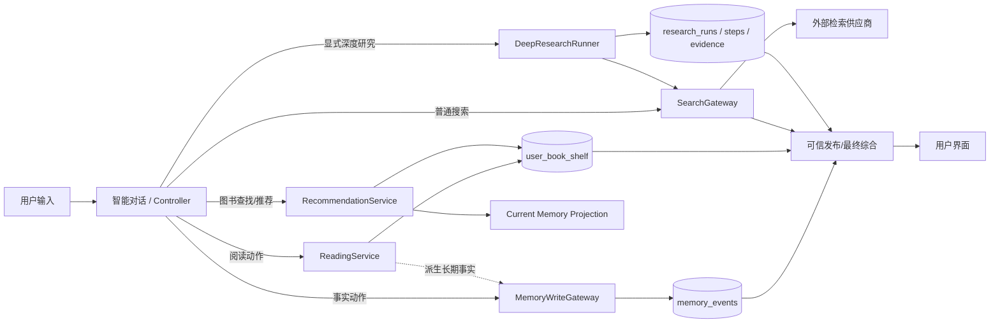

# 系统功能模块设计

## 1. 划分原则

本系统当前没有独立的“管理员”或“图书管理员”业务工作台。论文功能模块按真实用户能力和生产服务边界划分，不根据数据库表数量机械拆分，也不把模型、搜索供应商或 PostgreSQL 当成用户角色。

## 2. 一级、二级功能模块

| 一级模块 | 二级模块 | 当前真实功能 | 主要实现依据 |
|---|---|---|---|
| 智能对话 | 会话管理 | 新建、查看、重命名、删除会话，保存对话历史 | `api/v1/chat/conversations.py`、`ConversationJournalService` |
| 智能对话 | 模型对话 | 选择模型、输入问题、流式输出、直接回答或受控业务执行 | `chat/run.py`、`ChatStreamingService`、`AgentChatEntry` |
| 智能对话 | 语义决策与受控执行 | Controller 一次理解；验证/编译动作；Runtime 执行；可信发布 | `agent_core/controller_client.py`、`turn_loop.py`、`harness.py` |
| 智能对话 | 执行可视化 | 本轮步骤、完整执行图、执行状态、Token 用量 | `turn-dag-sidebar.tsx`、`token-stats-panel.tsx`、`api/v1/traces.py` |
| 阅读资产管理 | 个人书架 | 添加图书、查看列表、搜索、按状态筛选、移出书架 | `ReadingService`、`bookshelf-view.tsx` |
| 阅读资产管理 | 阅读状态 | 想读、在读、已读、弃读等状态维护 | `ReadingService.upsert/update_entry()` |
| 阅读资产管理 | 阅读反馈 | 喜欢、不喜欢、不感兴趣等评价，评分与备注 | `ReadingService`、`recommendation_events` |
| 阅读资产管理 | 自然语言更新 | 对话中的阅读事实由受控动作更新 Shelf，并产生审计事件 | Memory/Reading 运行时及 `ReadingService` |
| 长期记忆 | 多事实写入 | 一次 Controller 语义结果中的多条 assertions 分别写入 | `compiled_turn_from_assertions()`、`MemoryWriteGateway` |
| 长期记忆 | 实体绑定 | 同批事实先解析用户/图书等实体；歧义时请求澄清 | `EntityResolver`、`_bind_compiled_entities()` |
| 长期记忆 | 版本化存储 | 新建、修订、幂等去重、来源校验、遗忘 tombstone | `MemoryVersionStore`、`memory_events` |
| 长期记忆 | 当前事实投影 | 从完整版本链投影当前可用事实，兼容旧命名槽位 | `MemoryReadGateway`、`current_projection.py` |
| 长期记忆 | 记忆管理 | 分类查看、编辑、查看版本、明确遗忘 | `api/v1/memory.py`、`memory-management-dialog.tsx` |
| 图书搜索与个性化推荐 | 图书查找 lookup | 按查询和结构化条件寻找具体图书，不做个性化排除 | `RecommendationService.search_catalog/search()` |
| 图书搜索与个性化推荐 | 普通推荐 recommendation | 一次语义理解读取有界 Shelf 快照并产生候选，工具核验后结合 Memory、Shelf、事件和交互排序 | `ControllerRequestBuilder`、`RecommendationService`、`RecommendationProjector` |
| 图书搜索与个性化推荐 | 已知书排除 | 已在 Shelf 的想读/在读/已读/弃读图书不再作为“新书”推荐 | `RecommendationProjector._apply_shelf_state()` |
| 图书搜索与个性化推荐 | 候选完整发布 | 模型负责最终综合；确定性覆盖校验防止已核验候选在发布阶段被静默遗漏 | `TrustedPublisher.publish_synthesis()`、`complete_book_candidate_coverage()` |
| 图书搜索与个性化推荐 | 反馈学习 | 正负反馈、时间衰减行为信号、阅读锚点影响候选分值 | `recommendation_projection.py`、`recommendation_signals.py` |
| 普通 Search | 查询规划 | Controller 根据用户目标形成搜索动作和约束 | `AgentControllerGateway`、capability contract |
| 普通 Search | 联合检索 | failover 或 federated 多供应商检索、过滤、合并 | `external_search/gateway.py` |
| 普通 Search | 面向用户综合 | 将模型知识与检索 evidence 综合为自然回答并附来源 | `TrustedPublisher`、publication response view |
| 深度研究 | 研究目标规划 | 形成 UserAnswerBrief、决策维度、关键未知项、候选组合 | `objective_planner.py` |
| 深度研究 | 自适应多轮研究 | 并行检索分支、网页访问、内容质量检查、证据采纳 | `DeepResearchRunner` |
| 深度研究 | 缺口审查 | 确定性缺口评估 + Reviewer 生成下一轮可执行子问题 | `gap_evaluator.py`、`reviewer.py` |
| 深度研究 | 研究状态 | 保存研究任务、步骤、证据、停止条件和最终状态 | `ResearchOrchestrator`、三张 research 表 |
| 深度研究 | 报告发布 | PublicationPacket 保留候选/证据，报告模型输出最终 Markdown | `publication/packet.py`、`publication/report_writer.py` |
| 系统配置与运行支撑 | 用户身份 | 模拟用户登录、登出、微信扫码入口 | `api/v1/auth.py`、`api/v1/weixin.py` |
| 系统配置与运行支撑 | 模型配置 | Provider 连接、模型登记、启用/默认路由、能力验证 | `api/v1/models.py`、`provider-config-workbench-v2.tsx` |
| 系统配置与运行支撑 | 应用服务配置 | 记忆召回、研究观察、网页搜索凭据与健康检查 | `api/v1/provider_configs.py` |
| 系统配置与运行支撑 | 运行追踪 | DAG、步骤、checkpoint/replay、统计与错误诊断 | `api/v1/traces.py`、Chat stats API |

## 3. 论文功能模块图草稿

```mermaid
flowchart TB
    SYS[AI 大模型图书馆智能书籍管理系统]

    SYS --> C[智能对话]
    C --> C1[会话管理]
    C --> C2[模型对话]
    C --> C3[语义决策与受控执行]
    C --> C4[执行过程与 Token 统计]

    SYS --> R[阅读资产管理]
    R --> R1[个人书架]
    R --> R2[阅读状态]
    R --> R3[评价·评分·备注]
    R --> R4[自然语言更新阅读资产]

    SYS --> M[长期记忆]
    M --> M1[多事实写入与实体绑定]
    M --> M2[版本化存储]
    M --> M3[当前事实投影]
    M --> M4[编辑·历史·遗忘]

    SYS --> B[图书搜索与个性化推荐]
    B --> B1[图书查找 lookup]
    B --> B2[个性化推荐 recommendation]
    B --> B3[已知书排除]
    B --> B4[正负反馈与重排]

    SYS --> S[普通 Search]
    S --> S1[一次问题理解]
    S --> S2[并行/故障转移检索]
    S --> S3[证据增强综合]

    SYS --> D[深度研究]
    D --> D1[目标与候选规划]
    D --> D2[并行多轮研究]
    D --> D3[证据采纳与缺口审查]
    D --> D4[最终研究报告]

    SYS --> O[系统配置与运行支撑]
    O --> O1[用户身份]
    O --> O2[模型与 Provider 配置]
    O --> O3[应用服务配置]
    O --> O4[运行追踪与统计]
```

## 4. 模块协同图

## 5. 论文表述建议

系统不是“模型外包给工具”的固定流水线，而是“模型产生语义决策和最终表达，工具提供可执行事实、实时信息和可核验依据”。各服务坚持单一职责：Controller 负责理解与动作提议；Gateway/Service 负责业务边界；Store 负责持久化；Publisher/Report Writer 负责面向用户的最终交付。

普通 Search 与 Deep Research 共享外部检索和引用能力，但研究逻辑不同：普通 Search 追求一次快速、高质量回答；Deep Research 围绕结论缺口自适应扩展研究，保存研究状态并形成结构化长报告，不能写成“多轮 Search”。
