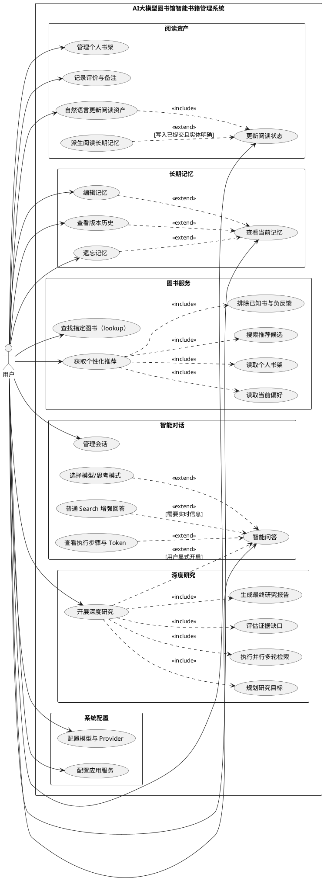

# UML 用例图材料

## 1. Actor 核验

当前主要业务参与者只有：**用户**。

模型服务、搜索供应商、数据库和微信平台是被系统调用的外部系统或基础设施，不是本论文主要业务用例中的人类 Actor。当前代码没有独立的管理员、图书管理员、采购员等业务角色，因此不得为了“图书馆系统”名称虚构这些角色。

## 2. 用户与真实用例关系

| 用户目标 | 真实用例 | 关系说明 |
|---|---|---|
| 管理对话 | 新建会话、查看历史、重命名、删除会话 | 用户直接发起 |
| 获得回答 | 智能问答 | 用户直接发起；系统可直接回答或执行受控能力 |
| 使用指定能力 | 选择模型、开启思考模式 | 对智能问答的可选扩展 |
| 获得实时资料 | 普通 Search 增强回答 | 对智能问答的按需扩展；并非每次对话都检索 |
| 研究复杂问题 | 开展深度研究 | 用户显式开启的独立研究模式，也是智能问答入口的可选扩展 |
| 查看执行过程 | 查看步骤/执行图/Token | 对一次已完成或执行中的问答/研究的可选扩展 |
| 管理阅读资产 | 查看书架、添加图书、更新状态、评价、备注、移除 | 用户直接发起，也可通过自然语言触发 |
| 自然语言修改阅读状态 | 自然语言更新阅读资产 | 用户直接发起；系统必须写入书架并记录事件 |
| 查找图书 | 查找指定图书 | `lookup` 模式，不强制读取个性化信息 |
| 获取新书建议 | 获取个性化推荐 | `recommendation` 模式；必须读取当前偏好和书架并排除已知书 |
| 管理长期事实 | 查看当前记忆、编辑、查看版本、遗忘 | 用户直接发起；编辑和遗忘保留版本链 |
| 配置运行能力 | 配置模型/Provider、配置搜索等应用服务 | 用户直接发起，凭据不应在论文截图中出现 |

## 3. include / extend 使用原则

- `<<include>>`：基础用例每次执行都需要的复用步骤。例如“个性化推荐”需要读取当前偏好、读取书架、发现候选和排除已知书。
- `<<extend>>`：仅在条件成立或用户选择时发生。例如普通 Search、深度研究、查看执行过程、选择模型。
- 不将数据库 CRUD 全部画成用户用例；“写表”“生成 receipt”属于实现步骤。
- “派生阅读 Memory”是 Reading 完成后的 best-effort 协同，不应画成每次书架写入都必定成功的 `include`，因此按扩展用例表示并在说明中注明条件。

## 4. PlantUML 用例图草稿

## 5. 中文用例说明

### 5.1 智能问答

用户输入自然语言问题并可选择模型。Controller 负责一次语义理解，若无需工具则直接回答；若需要记忆、阅读、图书或搜索能力，则先生成结构化动作，经验证、编译和受控执行后，再依据模型知识和已完成 evidence 生成最终回答。用户可选查看执行过程。

### 5.2 自然语言更新阅读资产

用户可以在 Chat 中表达“我正在读某书”“我不喜欢某书”等事实。系统将一次语义结果拆为原子 assertions，ReadingService 更新 `user_book_shelf` 并追加推荐/审计事件；在实体明确时，阅读事实通过统一 Memory gateway 派生为长期记忆。

### 5.3 个性化推荐

用户请求新的书籍建议。系统在一次语义理解中读取有界 Shelf 快照，由模型结合当前阅读资产产生新候选；检索工具核验并补充信息，随后从 Memory、Shelf、交互和推荐事件构建偏好与行为投影，排除已经在书架中的图书以及明确负反馈，再排序并返回推荐理由。发布阶段保留全部已核验候选。查找具体图书的 `lookup` 用例与该推荐逻辑分开。

### 5.4 长期记忆管理

用户查看系统当前使用的事实，可编辑、回看版本或明确遗忘。编辑产生新版本，遗忘产生 tombstone，旧版本不会被静默覆盖。阅读类事实在界面中提示到书架管理当前阅读状态。

### 5.5 深度研究

用户显式开启深度研究后，系统创建持久化研究运行，规划用户最终需要的交付形式，执行并行检索和网页证据采纳，通过缺口评估决定下一轮研究方向，并在预算、证据满足或边际信息增益不足时停止，最终生成面向用户的 Markdown 研究报告。

## 6. 定稿绘图要求

1. Actor 放在系统边界外，所有用例椭圆放在系统边界内。
2. 关联使用实线；`include/extend` 使用带方向的虚线箭头并标注 stereotype。
3. 不把类名、函数名、数据表名放入用例图；它们只出现在实现说明和第五章。
4. 如果版面拥挤，可拆成“总体用例图”和“智能推荐/深度研究子用例图”，但 Actor 均保持为用户。
