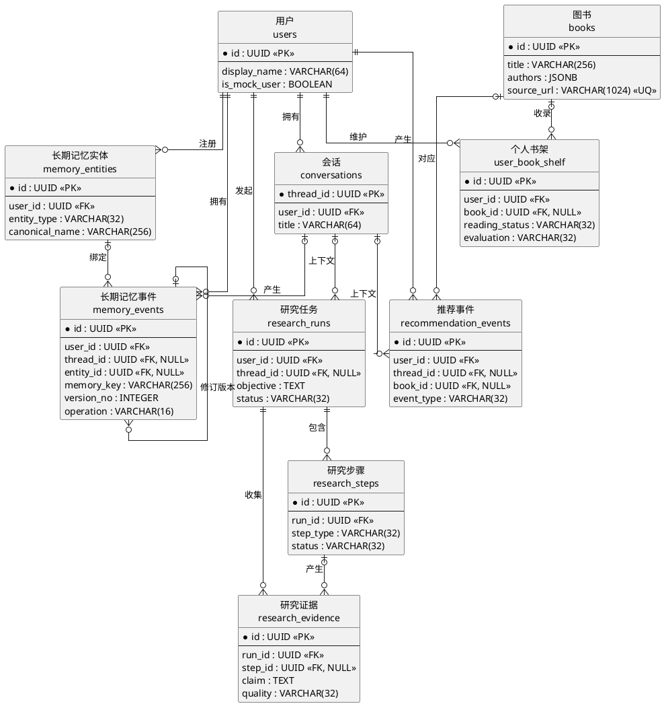

# 规范 E-R 图与核心数据库字段

## 1. 选取范围与口径

论文主 E-R 图选取 10 个能够解释核心业务闭环的实体：用户、会话、长期记忆实体、长期记忆事件、图书、个人书架、推荐事件、研究任务、研究步骤、研究证据。

没有把所有配置表、Trace 表、登录表、状态快照和兼容表塞入主图。字段依据当前 SQLAlchemy ORM，并用 SQL 迁移核验唯一约束、检查约束和被迁移覆盖的物理外键。

## 2. 核心实体与真实关系

| 中文实体 | 数据库表 | 主键 | 主要外键 | 真实关系 |
|---|---|---|---|---|
| 用户 | `users` | `id` | — | 用户 1:N 会话、记忆实体、记忆事件、书架条目、推荐事件、研究任务 |
| 会话 | `conversations` | `thread_id` | `user_id → users.id` | 一个用户有多个会话；Memory/推荐/研究记录可选择关联会话 |
| 长期记忆实体 | `memory_entities` | `id` | `user_id → users.id` | 用户 1:N 记忆实体；实体 1:N 记忆事件 |
| 长期记忆事件 | `memory_events` | `id` | `user_id`、可空 `thread_id`、可空 `entity_id`、多个自关联版本字段 | 保存完整版本链；同一 `memory_key` 的当前头通过版本字段和唯一约束识别 |
| 图书 | `books` | `id` | — | 与用户通过个人书架形成概念 M:N；与推荐事件为 1:N |
| 个人书架 | `user_book_shelf` | `id` | `user_id → users.id`、可空 `book_id → books.id` | 用户与图书的关联实体，附带阅读状态、评价、备注；允许标题型未绑定图书记录 |
| 推荐事件 | `recommendation_events` | `id` | `user_id`、可空 `thread_id`、可空 `book_id` | 用户 1:N 推荐事件；会话/图书均为可选来源 |
| 研究任务 | `research_runs` | `id` | `user_id`、可空 `thread_id` | 用户 1:N 研究任务；任务 1:N 步骤和证据 |
| 研究步骤 | `research_steps` | `id` | `run_id → research_runs.id` | 研究任务 1:N 研究步骤；步骤 1:N 证据（证据端可空） |
| 研究证据 | `research_evidence` | `id` | `run_id`、可空 `step_id` | 每条证据必须属于一个研究任务，可选择追溯到采集步骤 |

## 3. 基数与删除规则

| 关系名称 | 实体 A | 基数 | 实体 B | 外键与删除规则 |
|---|---|---:|---|---|
| 拥有会话 | 用户 | 1:N | 会话 | `conversations.user_id`，用户删除时 CASCADE |
| 注册记忆实体 | 用户 | 1:N | 长期记忆实体 | `memory_entities.user_id`，CASCADE |
| 拥有记忆事件 | 用户 | 1:N | 长期记忆事件 | `memory_events.user_id`，CASCADE |
| 产生记忆 | 会话 | 1:N（记忆端 0..1） | 长期记忆事件 | `thread_id` 可空，会话删除时 SET NULL |
| 绑定实体 | 长期记忆实体 | 1:N（事件端 0..1） | 长期记忆事件 | `entity_id` 可空，实体删除时 SET NULL |
| 修订/替代 | 长期记忆事件 | 1:N 自关联 | 长期记忆事件 | `revision_of`、`superseded_by`、`previous_version_id` 均可空 |
| 维护书架 | 用户 | 1:N | 个人书架 | `user_book_shelf.user_id`，CASCADE |
| 收录图书 | 图书 | 1:N（书架端 0..1） | 个人书架 | `book_id` 可空，图书删除时 SET NULL |
| 用户—图书 | 用户 | M:N | 图书 | 由 `user_book_shelf` 关联实体实现；只对已绑定 `book_id` 的条目成立 |
| 产生推荐事件 | 用户 | 1:N | 推荐事件 | `recommendation_events.user_id`，CASCADE |
| 关联推荐上下文 | 会话 | 1:N（事件端 0..1） | 推荐事件 | `thread_id` 可空，SET NULL |
| 关联推荐图书 | 图书 | 1:N（事件端 0..1） | 推荐事件 | `book_id` 可空，SET NULL |
| 发起研究 | 用户 | 1:N | 研究任务 | `research_runs.user_id`，CASCADE |
| 关联研究会话 | 会话 | 1:N（任务端 0..1） | 研究任务 | `thread_id` 可空，SET NULL |
| 包含步骤 | 研究任务 | 1:N | 研究步骤 | `research_steps.run_id`，CASCADE |
| 收集证据 | 研究任务 | 1:N | 研究证据 | `research_evidence.run_id`，CASCADE |
| 产生证据 | 研究步骤 | 1:N（证据端 0..1） | 研究证据 | `step_id` 可空，SET NULL |

## 4. Crow's Foot / PlantUML 草稿

## 5. Chen 记法重绘说明

教师若要求传统 Chen E-R 图，应按以下规则重绘，而不是把数据表画成普通流程框：

1. 实体使用矩形；联系使用菱形；属性使用椭圆。
2. 主键属性加下划线，例如用户的 `id`、会话的 `thread_id`。
3. 在联系两端明确标注 `1`、`N` 或 `M`。
4. `用户—维护—个人书架` 为 1:N；`图书—收录于—个人书架` 为 1:N（书架端允许未绑定图书）；通过关联实体表达用户与图书的 M:N。
5. `研究任务—包含—研究步骤` 和 `研究任务—收集—研究证据` 均为 1:N；`研究步骤—产生—研究证据` 为 1:N 且证据可不绑定步骤。
6. 不把 `CurrentProjection` 画成实体，它是从 `memory_events` 版本链计算出的读模型。

## 6. 核心数据库字段表

### 6.1 用户表 `users`

| 字段名 | 数据类型 | 主键/外键 | 是否为空 | 说明 |
|---|---|---|---|---|
| id | UUID | PK | 否 | 用户唯一标识 |
| display_name | VARCHAR(64) | — | 否 | 显示名称 |
| is_mock_user | BOOLEAN | — | 否 | 是否模拟用户 |
| created_at | TIMESTAMPTZ | — | 否 | 创建时间 |
| updated_at | TIMESTAMPTZ | — | 否 | 更新时间 |

### 6.2 会话表 `conversations`

| 字段名 | 数据类型 | 主键/外键 | 是否为空 | 说明 |
|---|---|---|---|---|
| thread_id | UUID | PK | 否 | 会话唯一标识 |
| user_id | UUID | FK → users.id | 否 | 所属用户 |
| title | VARCHAR(64) | — | 否 | 会话标题 |
| is_deleted | BOOLEAN | — | 否 | 软删除标记 |
| created_at | TIMESTAMPTZ | — | 否 | 创建时间 |
| updated_at | TIMESTAMPTZ | — | 否 | 更新时间 |
| input_tokens | BIGINT | — | 否 | 输入 Token 累计 |
| output_tokens | BIGINT | — | 否 | 输出 Token 累计 |
| total_tokens | BIGINT | — | 否 | Token 总量 |
| journal_sequence | BIGINT | — | 否 | 会话事件序列水位 |

### 6.3 长期记忆实体表 `memory_entities`

| 字段名 | 数据类型 | 主键/外键 | 是否为空 | 说明 |
|---|---|---|---|---|
| id | UUID | PK | 否 | 实体唯一标识 |
| user_id | UUID | FK → users.id | 否 | 所属用户 |
| entity_type | VARCHAR(32) | — | 否 | 实体类型，如 book |
| canonical_name | VARCHAR(256) | — | 否 | 规范名称 |
| aliases | JSONB | — | 否 | 别名数组 |
| domain | VARCHAR(32) | — | 否 | 实体领域 |
| external_ref | JSONB | — | 否 | 外部引用信息 |
| created_at | TIMESTAMPTZ | — | 否 | 创建时间 |
| updated_at | TIMESTAMPTZ | — | 否 | 更新时间 |

真实唯一约束：`(user_id, entity_type, canonical_name)`。

### 6.4 长期记忆事件表 `memory_events`

| 字段名 | 数据类型 | 主键/外键 | 是否为空 | 说明 |
|---|---|---|---|---|
| id | UUID | PK | 否 | 记忆版本记录标识 |
| user_id | UUID | FK → users.id | 否 | 所属用户 |
| thread_id | UUID | FK → conversations.thread_id | 是 | 来源会话 |
| type | VARCHAR(32) | — | 否 | 兼容性记忆类型 |
| subject | VARCHAR(64) | — | 否 | 事实主语 |
| entity_id | UUID | FK → memory_entities.id | 是 | 绑定的稳定实体 |
| domain | VARCHAR(32) | — | 是 | 业务领域 |
| kind | VARCHAR(32) | — | 是 | 事实种类 |
| value | TEXT | — | 否 | 序列化事实值 |
| polarity | VARCHAR(32) | — | 否 | 极性 |
| confidence | FLOAT | — | 否 | 置信度 |
| source | VARCHAR(32) | — | 否 | 来源类型 |
| metadata | JSONB | — | 否 | 扩展元数据 |
| revision_of | UUID | 自 FK → memory_events.id | 是 | 被修订记录 |
| superseded_by | UUID | 自 FK → memory_events.id | 是 | 替代该记录的新版本 |
| chain_id | UUID | — | 是 | 版本链标识 |
| schema_key | VARCHAR(128) | — | 是 | 版本化 schema |
| memory_key | VARCHAR(256) | — | 是 | 事实稳定键 |
| version_no | INTEGER | — | 是 | 链内版本号 |
| operation | VARCHAR(16) | — | 是 | create/revise/forget 等操作 |
| previous_version_id | UUID | 自 FK → memory_events.id | 是 | 前一版本 |
| source_event_id | UUID | 逻辑来源标识 | 是 | 迁移 031 后无物理 FK，可指不同 provenance 事件 |
| receipt_id | VARCHAR(128) | — | 是 | 幂等回执标识 |
| canonical_hash | VARCHAR(64) | — | 是 | 规范事实哈希 |
| schema_version | INTEGER | — | 是 | schema 版本 |
| valid_from | TIMESTAMPTZ | — | 是 | 有效开始时间 |
| valid_to | TIMESTAMPTZ | — | 是 | 有效结束时间；当前头为空 |
| is_deleted | BOOLEAN | — | 否 | 删除/遗忘兼容标记 |
| deleted_at | TIMESTAMPTZ | — | 是 | 删除时间 |
| created_at | TIMESTAMPTZ | — | 否 | 创建时间 |
| updated_at | TIMESTAMPTZ | — | 否 | 更新时间 |

真实关键约束包括链内版本唯一、活跃 head 唯一和 receipt 幂等约束；详见 `change_012_memory_version_chain.sql`。

### 6.5 图书表 `books`

| 字段名 | 数据类型 | 主键/外键 | 是否为空 | 说明 |
|---|---|---|---|---|
| id | UUID | PK | 否 | 图书标识 |
| title | VARCHAR(256) | — | 否 | 书名 |
| subtitle | VARCHAR(256) | — | 是 | 副标题 |
| authors | JSONB | — | 否 | 作者数组 |
| tags | JSONB | — | 否 | 标签数组 |
| summary | TEXT | — | 是 | 内容简介 |
| rating | NUMERIC(3,1) | — | 是 | 外部评分 |
| rating_count | INTEGER | — | 是 | 评分人数 |
| cover_url | VARCHAR(1024) | — | 是 | 封面地址 |
| source_name | VARCHAR(64) | — | 否 | 来源名称 |
| source_url | VARCHAR(1024) | UQ | 是 | 来源页面；唯一 |
| external_id | VARCHAR(128) | — | 是 | 外部系统标识 |
| raw_data | JSONB | — | 否 | 来源原始元数据 |
| last_seen_at | TIMESTAMPTZ | — | 否 | 最近观察时间 |
| created_at | TIMESTAMPTZ | — | 否 | 创建时间 |
| updated_at | TIMESTAMPTZ | — | 否 | 更新时间 |

### 6.6 个人书架表 `user_book_shelf`

| 字段名 | 数据类型 | 主键/外键 | 是否为空 | 说明 |
|---|---|---|---|---|
| id | UUID | PK | 否 | 书架条目标识 |
| user_id | UUID | FK → users.id | 否 | 所属用户 |
| book_id | UUID | FK → books.id | 是 | 绑定图书；标题型记录可空 |
| title | VARCHAR(256) | — | 否 | 书名快照 |
| authors | JSONB | — | 否 | 作者快照 |
| tags | JSONB | — | 否 | 标签快照 |
| cover_url | VARCHAR(1024) | — | 是 | 封面快照 |
| source_url | VARCHAR(1024) | — | 是 | 来源页面 |
| reading_status | VARCHAR(32) | — | 否 | 当前阅读状态 |
| evaluation | VARCHAR(32) | — | 是 | 当前阅读评价 |
| note | TEXT | — | 否 | 阅读备注 |
| rating | INTEGER | — | 是 | 用户评分 |
| last_event_at | TIMESTAMPTZ | — | 是 | 最近状态事件时间 |
| created_at | TIMESTAMPTZ | — | 否 | 创建时间 |
| updated_at | TIMESTAMPTZ | — | 否 | 更新时间 |

真实约束：`UNIQUE(user_id, book_id)`；`reading_status`、`evaluation`、`rating` 有 SQL CHECK 约束。由于 PostgreSQL 唯一约束允许多个 NULL，标题型记录由 ReadingService 业务查重。

### 6.7 推荐事件表 `recommendation_events`

| 字段名 | 数据类型 | 主键/外键 | 是否为空 | 说明 |
|---|---|---|---|---|
| id | UUID | PK | 否 | 推荐信号标识 |
| user_id | UUID | FK → users.id | 否 | 所属用户 |
| thread_id | UUID | FK → conversations.thread_id | 是 | 来源会话 |
| request_id | VARCHAR(128) | — | 是 | 请求标识 |
| message_id | VARCHAR(128) | — | 是 | 消息标识 |
| book_id | UUID | FK → books.id | 是 | 对应图书 |
| book_title | VARCHAR(256) | — | 是 | 书名快照 |
| event_type | VARCHAR(32) | — | 否 | 信号类型 |
| signal_polarity | VARCHAR(16) | — | 否 | positive/negative/neutral |
| signal_strength | NUMERIC(4,3) | — | 否 | 信号强度 |
| source | VARCHAR(32) | — | 否 | 事件来源 |
| metadata | JSONB | — | 否 | 扩展信息 |
| created_at | TIMESTAMPTZ | — | 否 | 创建时间 |
| updated_at | TIMESTAMPTZ | — | 否 | 更新时间 |

### 6.8 研究任务表 `research_runs`

| 字段名 | 数据类型 | 主键/外键 | 是否为空 | 说明 |
|---|---|---|---|---|
| id | UUID | PK | 否 | 研究任务标识 |
| user_id | UUID | FK → users.id | 否 | 发起用户 |
| thread_id | UUID | FK → conversations.thread_id | 是 | 所属会话 |
| objective | TEXT | — | 否 | 研究目标 |
| status | VARCHAR(32) | — | 否 | 运行状态 |
| mode | VARCHAR(32) | — | 否 | 研究模式；生产深度研究写入 deep_research |
| budget | JSONB | — | 否 | 轮次、结果量等预算 |
| stop_criteria | JSONB | — | 否 | 停止条件 |
| metadata | JSONB | — | 否 | 目标规划、审查等元数据 |
| started_at | TIMESTAMPTZ | — | 否 | 启动时间 |
| finished_at | TIMESTAMPTZ | — | 是 | 完成时间 |
| created_at | TIMESTAMPTZ | — | 否 | 创建时间 |
| updated_at | TIMESTAMPTZ | — | 否 | 更新时间 |

### 6.9 研究步骤表 `research_steps`

| 字段名 | 数据类型 | 主键/外键 | 是否为空 | 说明 |
|---|---|---|---|---|
| id | UUID | PK | 否 | 步骤标识 |
| run_id | UUID | FK → research_runs.id | 否 | 所属研究任务 |
| step_type | VARCHAR(32) | — | 否 | 步骤类型 |
| status | VARCHAR(32) | — | 否 | 步骤状态 |
| title | TEXT | — | 否 | 步骤标题 |
| query | TEXT | — | 否 | 检索查询 |
| url | TEXT | — | 否 | 访问地址 |
| rationale | TEXT | — | 否 | 执行理由 |
| input | JSONB | — | 否 | 步骤输入 |
| output | JSONB | — | 否 | 步骤输出 |
| error | TEXT | — | 是 | 错误信息 |
| duration_ms | INTEGER | — | 否 | 耗时毫秒数 |
| created_at | TIMESTAMPTZ | — | 否 | 创建时间 |
| updated_at | TIMESTAMPTZ | — | 否 | 更新时间 |

### 6.10 研究证据表 `research_evidence`

| 字段名 | 数据类型 | 主键/外键 | 是否为空 | 说明 |
|---|---|---|---|---|
| id | UUID | PK | 否 | 证据标识 |
| run_id | UUID | FK → research_runs.id | 否 | 所属研究任务 |
| step_id | UUID | FK → research_steps.id | 是 | 产生该证据的步骤 |
| source_type | VARCHAR(32) | — | 否 | 来源类型 |
| source_title | TEXT | — | 否 | 来源标题 |
| source_url | TEXT | — | 否 | 来源地址 |
| claim | TEXT | — | 否 | 可支持的事实声明 |
| excerpt | TEXT | — | 否 | 来源摘录 |
| quality | VARCHAR(32) | — | 否 | 质量等级 |
| relevance | INTEGER | — | 否 | 相关性评分 |
| metadata | JSONB | — | 否 | provider、候选绑定等元数据 |
| created_at | TIMESTAMPTZ | — | 否 | 创建时间 |
| updated_at | TIMESTAMPTZ | — | 否 | 更新时间 |

## 7. 不应写入主 E-R 图的内容

- `CurrentProjection`：计算得到的读模型，不是数据库实体；
- `PublicationPacket`：进程内发布数据契约，不是表；
- `MemoryWriteGateway`、`ReadingService`、`RecommendationService`：服务类，应出现在架构图/类图而非 E-R 图；
- `research_state_snapshots`、Trace、Provider 配置等辅助表：可以在数据库设计文字中说明，但主图不宜过载；
- legacy/deprecated Memory 表达：不能用于当前主图。
