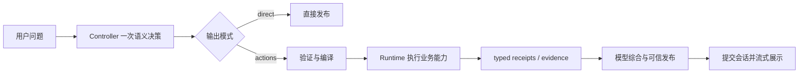
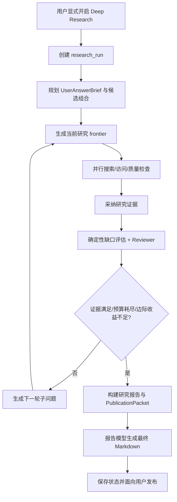

# 第五章真实核心代码摘录

## 1. 使用说明

以下片段均来自生产实现基准 `283db474065eae0d6959122ed1bdf9eeadd42975`，不包含 legacy/deprecated 路径。行号以该基准为准。论文正文每个功能宜保留 8～15 行最能说明核心机制的代码，并配合运行截图；复杂分布式流程用流程图解释，不要连续粘贴大段代码。

## 2. 5.1 普通 Chat 的可信综合与发布

- 中文功能名：普通 Chat 受控执行后的最终综合
- 文件路径：`backend/app/services/agent_core/turn_loop.py`
- 类/函数：`AgentTurnLoop.run()`
- 基准行号：155–167（13 行）
- 建议论文小节：**5.1 智能对话功能实现**

```python
if request.phase == "synthesis":
    try:
        answer = (
            self._publisher.publish_synthesis(
                output,
                evidence=evidence,
                user_request=request.current_user_message,
            )
            if _has_completed_evidence(evidence)
            else self._publisher.publish_model_knowledge_fallback(
                output
            )
        )
```

说明：该片段表明最终回答不是工具结果的简单排列。存在已完成 evidence 时由可信发布器综合；没有外部 evidence 时保留模型知识回答路径，符合“模型负责产生智能，工具负责增加信息”的增强原则。

建议配图：普通 Chat 最终回答截图 + 本轮执行步骤侧栏。完整受控链分布在 API、Entry、Gateway、Harness、Runtime 和 Publisher 多个文件中，正文宜再配流程图：



## 3. 5.2 一次语义理解中的多事实解析

- 中文功能名：Controller 多断言确定性适配
- 文件路径：`backend/app/services/memory/turn_compiler.py`
- 函数：`compiled_turn_from_assertions()`
- 基准行号：184–198（15 行）
- 建议论文小节：**5.2 多业务事实识别与执行**

```python
"""Adapt the Controller's first semantic result without reinterpreting it."""

facts: list[AtomicFact] = []
compiler = TurnFactCompiler()
for assertion in assertions:
    value = dict(assertion.value or {})
    qualifiers = dict(assertion.qualifiers or {})
    predicate = assertion.predicate.strip()
    domain = assertion.domain
    kind = assertion.kind
    entity_type = assertion.entity_type or str(
        qualifiers.get("entity_type") or value.get("entity_type") or ""
    ).strip()
    entity = ""
    attributes: dict[str, Any] = dict(value)
```

说明：Controller 的第一次语义结果可包含多条 `assertions`。编译器逐条转换为原子事实，不重新请求另一个模型解释原句，避免模型识别结果被脚手架二次覆盖。

建议配图：在 Chat 中一次输入同时包含“宠物改名 + 阅读状态/评价”等两项事实，随后展示两个业务结果；不要展示模型私有思考过程。

## 4. 5.3 长期记忆统一写入入口

- 中文功能名：结构化断言经 MemoryWriteGateway 提交
- 文件路径：`backend/app/services/memory/version_runtime.py`
- 函数：`execute_remember_memory()`
- 基准行号：43–57（15 行）
- 建议论文小节：**5.3 长期记忆写入与版本管理**

```python
compiled = compiled_turn_from_assertions(
    request.assertions,
    raw_text=source_text,
)
source_event_id, database = await _source_event_id(context)
if source_event_id is None:
    return _missing_source_result()
async with database.session() as session:
    gateway = MemoryWriteGateway(session)
    outcome = await gateway.commit_compiled(
        compiled=compiled,
        user_id=context.user_id,
        thread_id=context.thread_id,
        source_event_id=source_event_id,
        receipt_id=_receipt_id(context, action_id),
```

说明：生产 Runtime 不直接写 `memory_events`，而是要求存在来源事件，再由 `MemoryWriteGateway` 提交。Gateway 后续完成实体绑定、事实协议执行并调用 `MemoryVersionStore` 形成版本链。

建议配图：记忆中心“当前记忆”与某条事实的“版本时间线”。版本链、幂等锁和来源校验分散在多个方法中，论文可用流程图补充：`assertions → entity binding → ModelFactExecutor → VersionStore → current projection`。

## 5. 5.4 阅读资产写入个人书架

- 中文功能名：ReadingService 新建当前书架状态
- 文件路径：`backend/app/services/books/reading_service.py`
- 类/函数：`ReadingService.upsert()`
- 基准行号：450–464（15 行）
- 建议论文小节：**5.4 个人书架与阅读状态管理**

```python
if entry is None:
    entry = UserBookShelf(
        user_id=user_id,
        book_id=book.id if book else None,
        title=resolved_title,
        authors=list(book.authors or []) if book else [],
        tags=list(book.tags or []) if book else [],
        cover_url=book.cover_url if book else None,
        source_url=book.source_url if book else None,
        reading_status=status or "want_to_read",
        evaluation=(
            evaluation_value if evaluation_value is not _UNSET else None
        ),
        note=note_value if note_value is not _UNSET else "",
        rating=rating_value if rating_value is not _UNSET else None,
```

说明：`user_book_shelf` 保存用户当前阅读资产；即使尚未绑定 `books.id`，也可按标题保存条目。状态、评价、备注和评分都由 ReadingService 统一维护，而不是由 Chat 直接执行 SQL。

建议配图：我的书架中一条展开的真实记录，显示阅读进度、阅读感受和备注。

## 6. 5.5 Reading 派生长期记忆

- 中文功能名：阅读事实重新进入统一 Memory Gateway
- 文件路径：`backend/app/services/books/reading_service.py`
- 函数：`write_reading_memory_best_effort()`
- 基准行号：1068–1079（12 行）
- 建议论文小节：**5.5 阅读资产与长期记忆协同**

```python
gateway = MemoryWriteGateway(session)
outcome = await gateway.record_reading_memory(
    user_id=user_id,
    thread_id=thread_id,
    book_title=book_title,
    reading_status=reading_status,
    evaluation=evaluation,
    entity_id=entity_id,
    receipt_id=str(uuid.uuid4()),
    source_event_id=source_event_id or uuid.uuid4(),
    evidence=note or book_title,
)
```

说明：ReadingService 不直接调用 Memory Provider。派生事实先绑定图书实体，然后从统一 Gateway 写入 `reading.state` 或 `reading.feedback` 版本链。Shelf 仍是当前阅读状态权威来源，Memory 提供跨会话事实。

建议配图：先展示自然语言更新阅读状态的 Chat 回答，再展示书架状态和记忆中心阅读记忆，形成三图或两图对照。

## 7. 5.6 个性化推荐的书架访问、排重与可信发布

- 中文功能名：推荐请求读取当前书架
- 文件路径：`backend/app/services/agent_core/request_builder.py`
- 类/函数：`ControllerRequestBuilder._shelf_context()`
- 基准行号：197–208（12 行）
- 建议论文小节：**5.6 个性化图书推荐实现**

```python
if not is_book_recommendation_request(current_user_message):
    return []
try:
    from app.services.books.reading_service import ReadingService

    items, _ = await ReadingService(db).list_entries(
        user_id=user_id,
        limit=20,
        offset=0,
    )
except Exception:
    return []
```

说明：只在推荐语义下加载有界 Shelf 快照，避免把全量阅读资产注入无关对话。该快照进入 Controller 的一次语义决策，模型无需让用户重新复述书架即可产生候选。

- 中文功能名：已知书候选抑制、正负行为反馈计分
- 文件路径：`backend/app/services/recommendation_projection.py`
- 类/函数：`RecommendationProjector._apply_shelf_state()` 及行为事件投影逻辑
- 基准行号：552–562（11 行）、506–520（15 行）
- 建议论文小节：**5.6 个性化图书推荐实现**

已知书排除：

```python
"""Keep every Shelf-known book out of the new-book candidate set."""
status, evaluation = _shelf_state_for_book(book, shelf)
if status in {"reading", "read", "dropped"}:
    projection.suppressed = True
    projection.suppression_reasons.append(f"shelf_status_{status}")
if evaluation in {"disliked", "not_interested"}:
    projection.suppressed = True
    projection.suppression_reasons.append(f"shelf_evaluation_{evaluation}")
if status == "want_to_read":
    projection.suppressed = True
    projection.suppression_reasons.append("shelf_status_want_to_read")
```

正负行为反馈（基准行号 509–522，共 14 行）：

```python
event_type = normalize_recommendation_token(event.event_type)
strength = _to_float(event.signal_strength)
decay = _decay_multiplier(event.created_at, now, self.attention_half_life_days)
delta = _event_delta(event_type, event.signal_polarity, strength) * decay
if delta:
    projection.behavior_score += delta
    if delta > 0:
        projection.positive_reasons.append(
            f"recent behavior signal: {event_type}"
        )
    else:
        projection.negative_reasons.append(
            f"negative behavior signal: {event_type}"
        )
```

候选完整发布：

- 文件路径：`backend/app/services/agent_core/publication/service.py`
- 类/函数：`TrustedPublisher.publish_synthesis()`
- 基准行号：73–80（8 行）

```python
content = validate_synthesis(output.text, evidence=evidence)
content = ensure_explicit_evidence_format(
    content,
    evidence,
    user_request=user_request,
)
content = complete_book_candidate_coverage(content, evidence)
content = validate_synthesis(content, evidence=evidence)
```

说明：系统将“找一本已知书”的 lookup 和“推荐新书”的 recommendation 分开。只有 recommendation 读取 Memory、Shelf、阅读锚点和行为事件；所有 Shelf 已知书均退出新书候选，正负反馈通过强度和时间衰减影响排序。最终仍由模型生成面向用户的答案，覆盖校验只补回已核验却被遗漏的候选，避免工具增强反而压缩结果。

建议配图：先在书架显示已读/想读书，再请求相同主题的新书推荐，截图中推荐结果不包含已知书，并显示有区分度的推荐理由。

## 8. 5.7 普通 Search 的并行联邦检索

- 中文功能名：多供应商并行检索组合
- 文件路径：`backend/app/services/external_search/gateway.py`
- 类/函数：`SearchGateway._search_federated()`
- 基准行号：118–125（8 行）
- 建议论文小节：**5.7 普通 Search 增强回答实现**

```python
ordered = provider_order(request, previously_used=previously_used)[
    : request.provider_budget
]
executions = await _execute_federated_portfolio(
    ordered,
    providers=providers,
    request=request,
)
```

说明：普通 Search 根据 provider budget 选择检索组合并并行执行，随后去重合并 hits、保留 provider diagnostics。检索结果不是最终 UI 答案，而是返回 Agent Core 的 evidence，由模型完成一次面向用户的综合。

建议配图：一个需要近期资料的普通 Chat 回答，正文结构完整且带可点击来源。完整链更适合画程序流程图：


## 9. 5.8 Deep Research 自适应研究

- 中文功能名：并行研究分支与缺口驱动追问
- 文件路径：`backend/app/services/research/deep_research_runner.py`
- 函数：`run_deep_research()`
- 基准行号：963–975（13 行）、1198–1209（12 行）
- 建议论文小节：**5.8 深度研究功能实现**

并行研究分支：

```python
branch_results = await asyncio.gather(
    *(
        _search_round(
            orchestrator=orchestrator,
            user_id=user_id,
            run_id=run_id,
            task=round_task,
            get_search_gateway=get_search_gateway,
            check_content_garbage=check_content_garbage,
            max_records_per_round=budget.max_records_per_round,
        )
        for round_task in round_tasks
    )
)
```

缺口驱动下一轮：

```python
if not review.next_subquestions and assessment.should_continue:
    repair_task = plan_research_search_task(
        objective=objective,
        round_index=min(
            round_index + 1,
            budget.max_search_rounds,
        ),
        budget=budget,
        previous_assessment=assessment,
    )
    if repair_task.should_search:
        review.next_subquestions = [repair_task.query]
```

说明：Deep Research 围绕证据缺口产生下一轮问题，并行执行研究分支；最大轮次只是安全预算，不是固定研究脚本。由于完整流程还包含目标规划、网页访问、证据采纳、Reviewer、停止条件、PublicationPacket 和 Report Writer，正文应以程序流程图为主，代码为辅。



## 10. 第五章编排建议

建议按以下顺序组织第五章，形成从对话入口到复杂研究的递进关系：

1. 智能对话与受控执行；
2. 多事实解析；
3. 长期记忆版本化；
4. 个人书架；
5. Shelf 与 Memory 协同；
6. 个性化推荐；
7. 普通 Search；
8. Deep Research。

每节采用“功能目标 → 程序流程/核心代码 → 运行截图 → 结果分析”的结构。不要在正文中展示内部提示词、模型完整思考过程、API Key 或大段日志。
