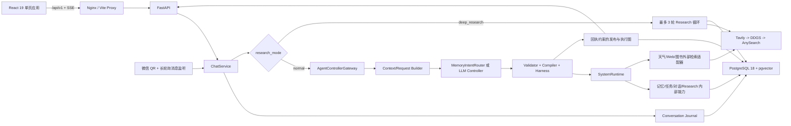

# 论文技术事实材料（基于当前真实源码）

> 核验基线：2026-08-12，Git `HEAD=11a128af125bac208d2f68efe4ee216ad4f14002`
> 核验原则：只使用当前源码、SQL 迁移、依赖声明、容器配置、测试/验证脚本和当前日志作为证据；未使用 `README.md`、`README.zh.md`、`memory-bank/`、`.agents/` 或现有 `docs/` 文档推断功能。

## 0. 口径和状态定义

- **已经实现**：在 FastAPI/React 当前入口可达，且主调用链有真实执行代码。
- **部分实现**：已有数据结构、API 或子系统，但关键环节未接入生产主链、默认关闭，或指标字段没有真实写入。
- **设计但未接入**：源码或历史模块仍在仓库中，但当前启动和请求路径没有调用它。

工作区在核验前已有用户改动：`README.md`、`README.zh.md`、`frontend/package-lock.json` 以及未跟踪的 `docs/`。本次未修改这些既有内容，仅新增本材料。

## 1. 项目解决的核心问题

### 1.1 可由源码支持的定位

**已经实现的核心是：一个支持持久对话上下文、长期记忆、外部信息检索、图书公开证据检索和深度研究的 Web AI 助手；其工程重点是把 LLM 限制为“决策/建议者”，由系统编译、准入、执行并按回执发布结果。**

证据：

- HTTP 聊天只进入 `ChatService` 和 Agent Core：`backend/app/api/v1/chat/run.py:62-98`、`backend/app/services/chat.py:25-116`。
- Controller 只允许输出直接回答、澄清、持久任务计划或已注册能力调用：`backend/app/services/agent_core/controller_client.py:68-228`。
- 当前对 Controller 开放的业务能力为对话读取、记忆写/查/忘、Research 读取、任务取消、天气、Web 搜索和图书搜索：`backend/app/services/agent_core/capabilities.py:63-243`、`backend/app/services/external_capabilities/availability.py:21-29`。
- 运行时逐个执行编译后的 action 并生成 `PlanReceipt`，不允许模型直接写库或调用外部服务：`backend/app/services/agent_runtime/runtime.py:63-210,345-435`。

### 1.2 不能改写成的定位

- 不是当前生产意义上的“多 Agent 协作系统”：当前主链只有一个 Controller LLM，工具由系统运行时执行。
- 不是已接入主链的“个性化图书排序/推荐引擎”：当前 Controller 的 `book_search` 只搜索公开图书证据，明确不读写缓存或用户状态：`backend/app/services/external_capabilities/book.py:21-65`。偏好、交互、推荐信号 API 和数据表存在，但不参与当前 Controller 排序。

## 2. 系统总体架构



| 层 | 职责 | 状态 | 主要证据 |
|---|---|---|---|
| 表现层 | React SPA：用户、对话、模型、Research、记忆、执行图、统计界面 | 已经实现 | `frontend/src/App.tsx:82-1759`、`frontend/src/features/**` |
| API 层 | FastAPI 路由、Pydantic 校验、SSE/WebSocket | 已经实现 | `backend/app/main.py:149-181`、`backend/app/api/v1/**` |
| 应用编排层 | `ChatService`、模型解析、Journal 事件、事务发布 | 已经实现 | `backend/app/services/chat.py:25-116` |
| Agent Core | 可可信上下文、Controller 决策、循环、编译、验证与回执 | 已经实现 | `backend/app/services/agent_core/**` |
| 系统运行时 | action 准入、依赖、超时、重试、执行、receipt | 已经实现 | `backend/app/services/agent_runtime/runtime.py:63-603` |
| 领域层 | 记忆版本链、对话 Journal、Research、任务、图书与推荐信号 | 混合 | `backend/app/services/memory/**`、`conversation/**`、`research/**`、`tasks/**` |
| 基础设施 | PostgreSQL/pgvector、LiteLLM/LangChain、搜索提供商、密钥加密 | 已经实现，部分需配置 | `backend/app/infra/**`、`docker-compose.yml:18-90` |

启动流程在 `lifespan` 中初始化系统 LLM、PostgreSQL、模型缓存、embedding 运行时/探测、checkpointer/store，并异步预热路由语义索引：`backend/app/main.py:68-138`、`backend/app/infra/database/factory.py:96-165`。**启动流程没有调用 `agents.supervisor.init_agent()`**。

## 3. 前端、后端、数据库与 AI 技术栈

| 领域 | 技术 | 源码/依赖事实 |
|---|---|---|
| 前端核心 | React 19.2、React DOM 19.2、TypeScript 5.9、Vite 8 | `frontend/package.json:33-34,58-60` |
| UI/CSS | Tailwind CSS 4.2、Radix UI、shadcn、lucide-react、class-variance-authority | `frontend/package.json:15-18,26-29,42-56` |
| 内容渲染 | TipTap 3.20、marked、react-markdown、remark-gfm、rehype-raw、Shiki、streamdown | `frontend/package.json:19-24,30,35,38-41` |
| 可视化 | Recharts 3.8；执行图为自定义 CSS DAG | `frontend/package.json:37`、`frontend/src/features/kanban/components/dag/CSSTurnDAG.tsx:21-437` |
| 后端 Web | Python 3.12 镜像、FastAPI 0.121.2、Uvicorn 0.38 | `backend/Dockerfile:2-3`、`backend/requirements.txt:1,16` |
| ORM/数据库 | SQLAlchemy async、asyncpg 0.31、psycopg-binary 3.3、PostgreSQL 18、pgvector 0.8.2 | `backend/app/infra/database/database.py:17-77`、`backend/requirements.txt:14-15`、`docker-compose.yml:19-33` |
| AI 抽象 | LangChain 1.3.1、LangChain Community 0.4.1、LangChain LiteLLM 0.6.6 | `backend/requirements.txt:3-5` |
| Agent/状态包 | LangGraph 1.2.0、langgraph-checkpoint-postgres 3.1.0 | `backend/requirements.txt:9-10` |
| 模型调用 | DB 驱动的 `ModelManager` + `ChatLiteLLM`，支持 provider/connection/model 动态配置 | `backend/app/infra/llm/manager.py:52-262`、`backend/app/infra/llm/factory.py:40-181` |
| 外部搜索 | Tavily、DuckDuckGo (`ddgs`)、AnySearch，顺序降级 | `backend/requirements.txt:7-8`、`backend/app/services/external_search/policy.py:6-25` |
| 认证/安全依赖 | JWT、passlib/bcrypt、cryptography；API 密钥加密存储 | `backend/requirements.txt:18-20`、`backend/app/infra/security.py:16-98`、`backend/app/utils/crypto.py` |
| 通信 | REST JSON、SSE、WebSocket（微信扫码）、aiohttp/requests | `backend/app/api/v1/chat/run.py:77-103`、`backend/app/api/v1/weixin.py:94-229` |
| 部署 | Docker Compose，前端 Nginx，后端 FastAPI，数据库 pgvector | `docker-compose.yml:18-90`、`frontend/nginx.conf.template:1-26` |

## 4. 完整源码目录结构及核心模块职责

### 4.1 源码级目录树

以下包含当前 81 个源码/配置目录，排除 `.git/`、`node_modules/`、`frontend/dist/`、`backend/.venv/`、`__pycache__/` 等依赖或生成物。仓库级扫描得到 767 个非文档源码/配置文件。

```text
.
├─ backend/
│  ├─ app/
│  │  ├─ agents/
│  │  │  ├─ middleware/
│  │  │  ├─ prompts/
│  │  │  └─ tools/
│  │  ├─ api/
│  │  │  └─ v1/
│  │  │     └─ chat/
│  │  ├─ channels/
│  │  │  └─ weixin/
│  │  ├─ crud/
│  │  ├─ infra/
│  │  │  ├─ database/
│  │  │  ├─ embedding_spaces/
│  │  │  └─ llm/
│  │  ├─ models/
│  │  ├─ schemas/
│  │  ├─ services/
│  │  │  ├─ agent_core/
│  │  │  │  └─ publication/
│  │  │  ├─ agent_runtime/
│  │  │  ├─ books/
│  │  │  ├─ conversation/
│  │  │  ├─ external_capabilities/
│  │  │  ├─ external_search/
│  │  │  │  └─ providers/
│  │  │  ├─ memory/
│  │  │  │  ├─ intent/
│  │  │  │  └─ providers/
│  │  │  ├─ model_probe/
│  │  │  ├─ planning/
│  │  │  │  └─ workflows/
│  │  │  ├─ research/
│  │  │  │  ├─ dedup/
│  │  │  │  ├─ harness/
│  │  │  │  ├─ loop/
│  │  │  │  ├─ observation_providers/
│  │  │  │  ├─ projection/
│  │  │  │  ├─ providers/
│  │  │  │  ├─ publication/
│  │  │  │  └─ verifier/
│  │  │  ├─ routing/
│  │  │  │  └─ capabilities/
│  │  │  └─ tasks/
│  │  └─ utils/
│  ├─ evals/
│  ├─ scripts/
│  │  ├─ developer_shadow_preview/
│  │  └─ sql/
│  └─ tests/
│     └─ fixtures/
├─ frontend/
│  ├─ scripts/
│  └─ src/
│     ├─ channels/
│     │  └─ weixin/
│     ├─ components/
│     │  ├─ ai/
│     │  ├─ ui/
│     │  └─ user/
│     ├─ contexts/
│     ├─ dev/
│     ├─ features/
│     │  ├─ chat/
│     │  │  └─ components/
│     │  ├─ kanban/
│     │  │  ├─ components/dag/
│     │  │  ├─ hooks/
│     │  │  ├─ styles/
│     │  │  ├─ types/
│     │  │  └─ utils/
│     │  └─ research/components/
│     ├─ hooks/
│     ├─ i18n/
│     ├─ lib/
│     └─ pages/
├─ imgs/
├─ docs/                 # 交付文档，不作为功能事实证据
├─ local-dev/            # 本地运行证据/日志/临时文件，非生产源码
├─ memory-bank/          # 说明性记录，本次不作证据
├─ .agents/              # 开发辅助材料，本次不作证据
└─ .vscode/
```

### 4.2 核心目录职责

| 目录 | 真实职责 | 生产主链地位 |
|---|---|---|
| `backend/app/api/v1/` | REST/SSE/WebSocket 路由，请求/响应模型绑定 | 已接入 |
| `backend/app/services/agent_core/` | Controller 请求构建、决策解析、循环、能力注册、编译、回执转回答、发布 | 已接入，当前 Agent 核心 |
| `backend/app/services/agent_runtime/` | 统一 action 准入和执行、超时/重试/依赖、`PlanReceipt` | 新 `SystemRuntime` 已接入；`coordinator.py` 的旧 Routing 协调器未接入 |
| `backend/app/services/conversation/` | 事件型 Journal、权威历史读取、结构化摘要 | 已接入 |
| `backend/app/services/memory/` | 确定性记忆意图、事实规范化、版本链、检索和 tombstone | 已接入；向量增强默认关闭 |
| `backend/app/services/external_capabilities/` | 天气、Web、图书业务参数到中性搜索请求的适配与回执清洗 | 已接入 |
| `backend/app/services/external_search/` | Tavily/DDGS/AnySearch 顺序尝试、URL 过滤、超时与结果投影 | 已接入 |
| `backend/app/services/research/` | Research 状态持久化、多轮搜索、缺口评估、证据准入、review 和报告写作 | `deep_research_runner.py` 已接入；其他 harness/verifier 不能概括为全部在主链 |
| `backend/app/services/tasks/` | 持久任务状态、计划版本、lease、执行回执、恢复 | 计划持久化已实现；自动 resume 默认关闭 |
| `backend/app/services/routing/` | 历史规则/关键词/语义 `RoutingFunnel` | 仅启动预热；当前 `ChatService` 不通过其 `ActionPlanner` |
| `backend/app/agents/` | `create_agent` 监督器、中间件和旧工具集 | 设计但未在启动/聊天主链初始化 |
| `backend/app/infra/` | 配置、DB、checkpointer/store、embedding space、LLM 模型管理 | 已接入 |
| `backend/app/models/` / `schemas/` / `crud/` | SQLAlchemy 表模型、Pydantic 契约、数据访问 | 已接入 |
| `backend/scripts/sql/` | 初始建表和 1–30 号变更 SQL | 需手工运行 `scripts/init_database.py` |
| `backend/tests/` / `scripts/verify_*.py` / `evals/` | pytest 测试、离线验收和评测样本 | 开发证据，非运行时 |
| `frontend/src/features/chat/` | 对话主界面、侧边栏、记忆、模型/提供商、统计、执行图 | 已接入 |
| `frontend/src/features/research/` | Research 列表、状态、步骤、证据和报告展示 | 已接入 |
| `frontend/src/features/kanban/` | 持久化 execution graph 的 CSS DAG 渲染 | 已接入 |
| `frontend/src/channels/weixin/` | 扫码 WebSocket 客户端 | 已挂载，认证安全边界部分实现 |


## 5. 用户一次请求进入系统后的完整调用流程

### 5.1 Web 端普通 SSE 请求（生产主路径）

1. `App.handleSendMessage` 校验内容/用户，必要时生成 UUID thread，确保会话存在，构造 `UserInput`（含 `content/thread_id/user_id/request_id/model_uuid/thinking_mode/research_mode/custom_data`）。证据：`frontend/src/App.tsx:786-911`。
2. `streamChat` 向 `POST /api/v1/chat/stream` 发送 JSON，按 SSE `data:` 分块解析。证据：`frontend/src/lib/api.ts:354-441`。
3. FastAPI 路由先根据 thread/user 建立或获取 `conversations` 记录，再返回 `StreamingResponse`。证据：`backend/app/api/v1/chat/run.py:28-41,77-103`。
4. `ChatStreamingService.generate` 先发 2 KB SSE comment 防止中间件缓冲，再委托 `TrustedControllerStream`。证据：`backend/app/services/streaming.py:11-29`。
5. `TrustedControllerStream` 立即发 `turn.started`，在独立 DB 事务中写入用户 Journal 事件。证据：`backend/app/services/agent_core/trusted_stream.py:38-81`。
6. 非 Deep Research 分支解析用户选定/默认模型，必要时刷新 DB 模型缓存。证据：`trusted_stream.py:93-128`、`backend/app/infra/llm/resolver.py:24-58`。
7. `AgentChatEntry.run` 调用 `AgentControllerGateway.evaluate`。Gateway 用 `ControllerRequestBuilder` 读取长期记忆、持久任务、工作状态、会话摘要/精确 Journal 和 Research 运行摘要。证据：`backend/app/services/agent_core/chat_entry.py:23-88`、`gateway.py:78-117`、`request_builder.py:50-153`。
8. `ControllerContextCoordinator` 在最近 20 个 exchange、12000 估算 token 预算下组装上下文；超限时最多做 8 轮摘要，摘要失败则降级到最近精确窗口，并显式告知模型不可猜测更早内容。证据：`context_assembler.py:107-223,257-265`、`context_coordinator.py:31-140`。
9. `TurnControllerLoop` 最多 6 轮。每轮先让 `MemoryIntentRouter` 尝试确定性记忆意图；未命中才调 `ControllerClient.decide`。证据：`backend/app/services/agent_core/turn_loop.py:30,59-119`、`backend/app/services/memory/intent/router.py:26-53`。
10. LLM Controller 通过 `bind_tools` 获得九个已启用能力 schema，另有澄清和持久任务计划结构工具；输出被严格解析为 proposal。证据：`controller_client.py:82-173`、`capabilities.py:220-243`。
11. `AgentCoreHarness` 调用 proposal validator 和 `WorkflowCompiler`，生成只含白名单 operation 的 `ActionPlan`；`SystemRuntime` 进行依赖、准入、执行、超时/重试并生成 `PlanReceipt`。证据：`backend/app/services/agent_core/harness.py:82-122`、`compiler.py:31-107`、`backend/app/services/agent_runtime/runtime.py:81-210`。
12. 如需继续推理，回执被投影回 Controller 上下文，下一轮由模型综合；能确定性发布的记忆/任务/Research 结果可由系统 renderer 生成。证据：`turn_loop.py:138-268`、`backend/app/services/agent_core/publication/service.py`。
13. 流式层先发 `graph.snapshot`，然后 `TurnPublicationCommitter` 在同一事务写入 assistant/澄清/失败 Journal 事件和脱敏 execution graph；提交成功后才发 `answer.completed` / `clarification.required` / `turn.failed`。证据：`trusted_stream.py:161-211`、`publication/commit.py:20-88`。
14. 前端把执行图 action 节点显示为工具进度，更新消息，刷新会话与自动标题。证据：`frontend/src/App.tsx:914-1167`。

**重要限定**：当前后端主路径不发送 token 增量事件，而是在完成并提交后发送完整终态答案。`run.py:44-58` 中的 token SSE 示例和路由 docstring 与 `TrustedControllerStream` 实际事件不一致；以 `trusted_stream.py:45,165-210` 为准。

### 5.2 非流式、Deep Research 与微信分支

- `POST /chat/invoke`：调用链相同，但 `ChatService.invoke` 在记录用户事件后立即 commit，最终直接返回 `ChatMessage`：`backend/app/services/chat.py:37-105`。
- Deep Research：`research_mode == "deep_research"` 时不调用 Controller 工具选择，显式进入 `run_deep_research_turn`：`chat.py:51-65`、`trusted_stream.py:83-91,213-285`。
- 微信：WebSocket 扫码确认后创建/绑定用户和固定 thread、生成 JWT、启动 `WeixinListener`：`backend/app/api/v1/weixin.py:180-229,264-299`。Listener 长轮询文本消息，构造 `UserInput`，调用同一 `ChatService.invoke` 后回发：`backend/app/services/weixin_listener.py:94-191`。

## 6–7. 已实现主要功能及真实源码映射

| 功能 | 状态 | 前端入口 | 后端类/函数与位置 |
|---|---|---|---|
| 用户选择与认证状态 | 部分实现 | `HomePage`：`frontend/src/pages/home-page.tsx:5-27`；`AuthProvider`：`frontend/src/contexts/AuthContext.tsx:40-123` | `get_auth_status/list_mock_users/mock_login/logout`：`backend/app/api/v1/auth.py:105-188` |
| 微信扫码登录与消息通道 | 已实现，安全部分 | `WeixinQRCode`：`frontend/src/channels/weixin/WeixinQRCode.tsx:22-200` | `weixin_auth_websocket/_create_weixin_user`：`api/v1/weixin.py:94-299`；`WeixinListener._message_loop/_handle_message`：`services/weixin_listener.py:94-191` |
| 会话列表、分页、创建、删除、重命名 | 已实现 | `ChatSidebar`：`frontend/src/features/chat/components/chat-sidebar.tsx:71-...`；`App` 相关 handlers | `get_conversations/save_conversation/delete_conversation/update_conversation_title`：`backend/app/api/v1/chat/conversations.py:53-195` |
| LLM 自动生成会话标题 | 已实现，受配额影响 | `App.tsx:1152-1167` | `generate_title`：`api/v1/chat/conversations.py:196-...` |
| 非流式聊天 | 已实现 | `invoke`：`frontend/src/lib/api.ts:354-359` | `ChatService.invoke`：`backend/app/services/chat.py:37-105` |
| SSE 轮次事件和完整终态答案 | 已实现 | `streamChat`：`frontend/src/lib/api.ts:361-441`；`handleSendMessage`：`App.tsx:786-1200` | `ChatStreamingService.generate`：`services/streaming.py:21-29`；`TrustedControllerStream.generate`：`agent_core/trusted_stream.py:38-211` |
| 真正逐 token 模型流 | 设计/前端兼容，后端未发送 | `App.addStreamToken`、`event.type==token`：`App.tsx:552-578,1024-1037` | 当前 `trusted_stream.py` 只发 typed terminal events |
| 可配置模型选择与 thinking mode | 已实现 | `useModels`、`ModelSelector`、`useThinkingMode` | `resolve_model_name/get_llm`：`infra/llm/resolver.py:24-58`、`factory.py:40-181`；`get_thinking_mode_status`：`api/v1/models.py:516-...` |
| 模型/provider/connection CRUD 与能力探测 | 已实现 | `ProviderConfigDialog`：`frontend/src/features/chat/components/provider-config-dialog.tsx:65-...` | `api/v1/models.py:57-531`；`ModelManager.refresh`：`infra/llm/manager.py:86-132`；`services/model_probe/**` |
| 外部搜索提供商配置/健康检查 | 已实现 | `AppProviderConfigDialog`：`frontend/src/features/chat/components/app-provider-config-dialog.tsx:79-...` | `api/v1/provider_configs.py:21-78`；`external_search/runtime_config.py` |
| 对话事件 Journal 与权威历史 | 已实现 | `getHistory`：`frontend/src/lib/api.ts:193-199` | `ConversationJournalService.record_*`：`services/conversation/journal_service.py:24-113`；`ConversationEventRepository.append/list_events`：`journal_repository.py:25-138` |
| 长对话结构化摘要与降级窗口 | 已实现 | 无独立 UI | `ControllerContextCoordinator.prepare`：`agent_core/context_coordinator.py:47-140`；`ConversationSummaryService`：`conversation/summary_service.py` |
| 记忆写入、修订、查询、历史、遗忘 | 已实现 | `MemoryManagementDialog`：`frontend/src/features/chat/components/memory-management-dialog.tsx:180-...` | `MemoryIntentRouter.route`：`memory/intent/router.py:26-213`；`MemoryVersionRuntime.execute_*`：`memory/version_runtime.py:28-...`；`MemoryVersionStore.commit/forget/list_*`：`memory/version_store.py:31-304` |
| 记忆管理面板 API | 已实现 | `getMemoryCurrent/History/editMemory/forgetMemory`：`frontend/src/lib/api.ts:201-236` | `list_current_memories/memory_history/edit_memory/forget_memory`：`api/v1/memory.py:33-213` |
| 记忆向量增强 | 部分实现，默认关闭 | 无显式 UI | `EMBEDDING_MEMORY_GENERATIONS_ENABLED=False`：`infra/config.py:89-94`；`MemoryVersionRuntime.search_memory` 可合并 semantic keys：`memory/version_runtime.py:65-102` |
| 天气查询 | 已实现，实质为网页搜索适配 | 聊天自然语言 | `WeatherRuntimeAdapter.execute`：`external_capabilities/weather.py:21-63`；operation `weather_get_v1` |
| Web 搜索 | 已实现 | 聊天自然语言 | `WebSearchRuntimeAdapter.execute`：`external_capabilities/web.py:21-68`；`SearchGateway.search`：`external_search/gateway.py:15-88` |
| 图书公开证据搜索 | 已实现 | 聊天自然语言 | `BookSearchRuntimeAdapter.execute`：`external_capabilities/book.py:21-65` |
| 图书独立搜索与本地缓存融合 | 已实现，与 Controller book tool 为两条路径 | 当前 `App` 未直接使用此搜索页 | `search_books`：`api/v1/books.py:47-65`；`search_and_cache_books_with_status`：`services/book_search.py:170-222` |
| 图书交互、偏好、推荐信号持久化 | 已实现的数据基础 | 推荐跟进信号：`App.tsx:228-293` | `api/v1/books.py:68-122`；`crud/book.py:108-232` |
| 用户个性化图书候选排序 | 设计但未接入当前 Controller | 无当前可达完整 UI | 旧 `agents/tools/books.py`、`recommendation_constraints.py`、`recommendation_projection.py`；监督器 tools 为空：`agents/supervisor.py:63-90` |
| Deep Research 多轮检索与报告 | 已实现（单次编辑型 Final Writer + 书单多条目抽取） | `researchMode`：`App.tsx:898-911`；`ResearchView`：`features/research/components/research-view.tsx:248-...` | `run_deep_research_turn/run_deep_research`：`research/deep_research_runner.py:76-409`；`research/publication/report_writer.py`；`research/source_extraction.py:368-...` |
| Research 状态、步骤、证据、报告 API | 已实现 | `listResearchRuns/getResearchState/finishResearch`：`frontend/src/lib/api.ts:270-324` | `api/v1/research.py:23-175`；`ResearchOrchestrator`：`research/orchestrator.py:18-222` |
| 从旧 Research 结果按需读取 | 已实现 | 通过聊天 | `research_read`：`agent_core/capabilities.py:125-139`；`execute_research_read`：`research/read.py:14-155` |
| 持久任务计划、版本与取消 | 部分实现 | 通过聊天，无独立任务 UI | `ControllerTaskPlanProposal`：`agent_core/task_plan_proposal.py:13-34`；`TaskRepository`：`tasks/repository.py:55-669`；`execute_create_task/plan_task/cancel`：`tasks/runtime.py:28-139` |
| 任务自动 resume 执行 | 已写代码，默认关闭 | 无 UI | `TaskResumeDispatcher.dispatch`：`tasks/resume_dispatcher.py:23-45`；`AGENT_TASK_RESUME_V1=False`：`infra/config.py:126-127` |
| 执行图持久化、查看和区间重放 | 已实现 | `TurnDAGSidebar`、`CSSTurnDAG` | `persist_publication_trace`：`agent_core/publication/trace.py:11-75`；`api/v1/traces.py:56-293` |
| token/日统计面板 | 部分实现 | `TokenStatsPanel`：`features/chat/components/token-stats-panel.tsx:231-...` | `api/v1/chat/stats.py:29-61`；当前发布链没有 token 用量写入 |
| 分享 | 仅复制当前 URL | `App.tsx:1588-1592`；`ShareDialog` | 无分享 token、ACL 或公开链接后端 |
| 中英文、明暗主题、Markdown/代码高亮 | 已实现 | `frontend/src/i18n/**`、`hooks/use-theme.tsx`、`components/ui/markdown-content.tsx` | 前端功能 |


## 8. 数据库表及各表用途

### 8.1 最终应用表集合

`scripts/init_database.py` 先执行 `init_database.sql`，再按数字顺序执行 `change_*.sql`：`backend/scripts/init_database.py:38-57,76-95`。按 1–30 号变更的最终效果，应用 DDL 定义 **30 张保留表**；`agent_capability_certifications` 和 `agent_shadow_observations` 被 027 号变更删除，`model_capability_checks` 被 028 删除后由 029 重建。

| 表 | 用途 | 主要源码位置 |
|---|---|---|
| `users` | 平台用户主体，含显示名、mock 标记和时间字段 | `backend/scripts/sql/init_database.sql:5-22`；`app/models/user.py:30-...` |
| `user_channels` | 用户与微信等外部通道的账号、token、base URL 绑定 | `init_database.sql:24-43`；`models/user_channel.py:28-...` |
| `conversations` | thread 所属用户、标题、模型和累计 token；同时保存 Journal sequence | `init_database.sql:45-73`；`models/chat.py:12-...`；`change_011_conversation_journal.sql` |
| `providers` | LLM provider 基本配置与旧式凭据/base URL | `init_database.sql:75-108`；`models/provider.py:22-...` |
| `provider_connections` | 同一 provider 的多个可编辑连接和加密 API key | `init_database.sql:110-142`、`change_004_provider_connections.sql`；`models/provider_connection.py:18-...` |
| `models` | LLM/VLM/embedding 模型、连接、默认/启用/thinking 属性 | `init_database.sql:144-179`；`models/model.py:31-...` |
| `model_capability_checks` | 模型能力探测结果与状态；029 号为当前版本 | `change_029_recreate_model_capability_checks.sql:5-...`；`models/model_capability.py:15-...` |
| `trace_executions` | 每个 request 的脱敏 DAG JSON、step 数和模型名 | `init_database.sql:208-224`；`models/trace.py:18-...` |
| `langchain_pg_collection` | PGVector collection 注册表 | `init_database.sql:226-233` |
| `langchain_pg_embedding` | 默认/旧式向量记录；在未激活新 generation 时可作 legacy source | `init_database.sql:235-246`；`infra/database/vectorstore.py:29,76-...`；`embedding_spaces/runtime.py:308` |
| `books` | 外部图书候选的本地缓存、来源 URL、作者/标签等 | `init_database.sql:248-273`；`models/book.py:16-...` |
| `book_interactions` | 用户对图书的点击、收藏、评分等交互 | `init_database.sql:275-294`；`models/book.py:48-...` |
| `user_preference_profiles` | 用户显式/聚合阅读偏好 | `init_database.sql:296-...`；`models/book.py:116-...` |
| `recommendation_events` | 推荐曝光、接受、拒绝、已读等事件信号 | `change_008_recommendation_events.sql:5-...`；`models/book.py:76-...` |
| `memory_events` | 长期记忆版本链：chain/key/version、前后版本、来源事件、回执、hash、有效期和 tombstone | `change_005_memory_events.sql:4-...` 及后续 memory 变更；`models/memory.py:24-...` |
| `memory_management_events` | 记忆面板创建、纠正、遗忘的用户来源审计事件 | `change_030_memory_management_events.sql:4-...`；`models/memory_management_event.py:16-...` |
| `research_runs` | Research 目标、模式、状态、预算、停止条件和 metadata | `change_006_research_state.sql:4-18`；`models/research.py:15-...` |
| `research_steps` | search/visit 等 Research 步骤、输入输出、状态、耗时和错误 | `change_006_research_state.sql:20-35`；`models/research.py:52-...` |
| `research_evidence` | Research claim、excerpt、来源 URL、质量、相关性和 metadata | `change_006_research_state.sql:37-51`；`models/research.py:82-...` |
| `research_state_snapshots` | 每次 Research 状态更新的子问题、事实、缺口、冲突和 next actions | `change_006_research_state.sql:53-...`；`models/research.py:115-...` |
| `app_provider_configs` | Tavily/AnySearch/DDGS 等应用级外部能力配置与健康状态 | `change_007_app_provider_configs.sql:4-...`；`models/app_provider_config.py:14-...` |
| `embedding_spaces` | embedding generation 的模型、维度、指纹、物理表名和状态 | `change_010_embedding_spaces.sql:5-51`；`infra/embedding_spaces/registry.py:92-158` |
| `embedding_space_bindings` | 文档/记忆等 purpose 当前绑定哪个 embedding space | `change_010_embedding_spaces.sql:53-...` |
| `embedding_calibration_reports` | generation 校准数据、precision/recall 等报告 | `change_026_embedding_generation_gates.sql:3-54` |
| `embedding_space_activations` | embedding generation 激活切换的审计与回退关系 | `change_026_embedding_generation_gates.sql:56-...` |
| `conversation_events` | 权威对话 Journal；按 user/thread/exchange/sequence 记录 user、assistant、clarification、failure | `change_011_conversation_journal.sql:7-...`；`models/conversation_event.py:24-...` |
| `conversation_summaries` | 覆盖某 sequence 区间的结构化对话摘要 | `change_014_conversation_summaries.sql:4-...`；`models/conversation_summary.py:21-...` |
| `task_states` | 持久任务状态、当前 plan version、lease、等待澄清/失败信息 | `change_016_task_state_and_receipts.sql:4-32`；`models/task.py:22-...` |
| `task_plan_versions` | 不可变任务计划版本、来源、父版本和 validation 信息 | `change_016_task_state_and_receipts.sql:34-62`；`models/task.py:117-...` |
| `action_execution_receipts` | 任务 action 的幂等执行回执、状态、输出/错误和时间 | `change_016_task_state_and_receipts.sql:64-...`；`models/task.py:155-...` |

### 8.2 动态表和迁移边界

- LangGraph PostgreSQL checkpointer/store 在启动时调用第三方包的 `setup()`：`backend/app/infra/database/checkpointer.py:33-58`、`store.py:38-55`。**这些包所有的物理表名没有在本仓库 DDL 中声明，因此不能只凭当前仓库源码把具体表名写入论文。**
- 新 embedding generation 物理表由 `VectorSchemaManager` 动态 `CREATE TABLE`，表名由 registry 生成：`backend/app/infra/embedding_spaces/schema.py:22-63`、`registry.py:339-358`。它们不是固定的单一表名。
- Docker Compose 只把 `init_database.sql` 挂到 PostgreSQL 初始化目录，并不自动执行 `change_*.sql`；backend entrypoint 也明确要求外部手工运行迁移：`docker-compose.yml:28-31`、`backend/entrypoint.sh:4-6`。因此“直接 `docker compose up` 即具备全部 30 张表”不能声称。
- 项目没有 Alembic 或迁移版本表；`init_database.py` 每次顺序执行 SQL，依赖各脚本自身的幂等 DDL。

## 9. API 接口及主要输入输出

应用实际导入后共注册 64 个业务/健康路由（含 1 个 WebSocket）。API 前缀为 `/api/v1`：`backend/app/infra/config.py:30-38`、`backend/app/main.py:173-181`。

### 9.1 健康、认证与图书

| 方法与路径 | 主要输入 | 主要输出 | 源码 |
|---|---|---|---|
| `GET /health` | 无 | `str` 健康状态 | `backend/app/main.py:177-181` |
| `GET /api/v1/auth/status` | Cookie/Bearer 可选 | `AuthStatusResponse` | `api/v1/auth.py:105-119` |
| `GET /api/v1/auth/mock-users` | 无 | `list[UserResponse]` | `auth.py:121-138` |
| `POST /api/v1/auth/mock-login` | `MockLoginRequest.user_id` | HTTP-only JWT cookie | `auth.py:140-166` |
| `POST /api/v1/auth/logout` | 无 | 删除认证 cookie | `auth.py:169-188` |
| `GET /api/v1/books` | `query? limit offset` | `list[BookInDB]`，本地缓存 | `api/v1/books.py:36-44` |
| `GET /api/v1/books/search` | `query limit` | `BookSearchResponse`，含状态、来源、耗时、候选来源 | `books.py:47-65` |
| `POST /api/v1/books/interactions` | `BookInteractionCreate` | `BookInteractionInDB` | `books.py:68-74` |
| `POST /api/v1/books/recommendation-events` | `RecommendationSignalCreate` | `RecommendationSignal` | `books.py:77-83` |
| `GET /api/v1/books/recommendation-events/{user_id}` | title/type/limit/offset | `list[RecommendationSignal]` | `books.py:86-103` |
| `GET /api/v1/books/preferences/{user_id}` | user_id | `UserPreferenceProfileInDB` | `books.py:106-112` |
| `PATCH /api/v1/books/preferences/{user_id}` | `UserPreferenceProfileUpdate` | 更新后的 profile | `books.py:115-122` |
| `GET /api/v1/books/{book_id}` | book UUID | `BookInDB \| None` | `books.py:125-131` |

### 9.2 聊天、会话、记忆与统计

| 方法与路径 | 主要输入 | 主要输出 | 源码 |
|---|---|---|---|
| `POST /api/v1/chat/invoke` | `UserInput` | `ChatMessage` | `api/v1/chat/run.py:62-74`；schema `schemas/chat.py:30-84` |
| `POST /api/v1/chat/stream` | `UserInput` | `text/event-stream`：turn、graph、terminal、`[DONE]` | `run.py:77-103`；`agent_core/trusted_stream.py:38-335` |
| `GET /api/v1/chat/conversations` | `user_id limit offset` | `list[ConversationInDB]` | `api/v1/chat/conversations.py:53-76` |
| `POST /api/v1/chat/conversations` | `ConversationCreate` | `ConversationInDB` | `conversations.py:77-89` |
| `DELETE /api/v1/chat/conversations/{thread_id}` | `user_id` | 204/删除结果 | `conversations.py:90-108` |
| `GET /api/v1/chat/conversations/{thread_id}/info` | `user_id` | `ConversationInfoResponse` | `conversations.py:109-148` |
| `GET /api/v1/chat/conversations/{thread_id}/title` | `user_id` | `ConversationInDB \| None` | `conversations.py:149-166` |
| `PATCH /api/v1/chat/conversations/{thread_id}/title` | `ConversationTitleUpdate` + user_id | 更新后的 conversation | `conversations.py:167-195` |
| `POST /api/v1/chat/conversations/{thread_id}/title/generate` | user_id/model | `TitleGenerateResponse` | `conversations.py:196-...` |
| `GET /api/v1/chat/history/{thread_id}` | `user_id` | `ChatHistory` | `api/v1/chat/history.py:31-...` |
| `GET /api/v1/chat/stats/daily` | `user_id days` | `list[DailyStatsItem]` | `api/v1/chat/stats.py:29-47` |
| `GET /api/v1/chat/conversations/{thread_id}/stats` | `user_id` | `ConversationInDB` token 字段 | `stats.py:49-61` |
| `GET /api/v1/memory/{user_id}/current` | user UUID | `MemoryAdminCurrentResponse` | `api/v1/memory.py:33-51` |
| `GET /api/v1/memory/{user_id}/history` | `memory_key` | `MemoryAdminHistoryResponse` | `memory.py:54-80` |
| `POST /api/v1/memory/edit` | `MemoryEditRequest` | `MemoryMutationReceipt`，201 | `memory.py:83-150` |
| `POST /api/v1/memory/forget` | `MemoryForgetAdminRequest` | `MemoryMutationReceipt` | `memory.py:153-213` |

### 9.3 模型和外部 provider 配置

| 方法与路径 | 主要输入 | 主要输出 | 源码 |
|---|---|---|---|
| `GET /api/v1/models` | active/type 等查询 | `ModelsResponse` | `api/v1/models.py:57-73` |
| `POST /api/v1/models` | `ModelCreate` | `ModelInfo` | `models.py:74-134` |
| `PATCH /api/v1/models/{model_id}` | `ModelUpdate` | `ModelInfo` | `models.py:135-179` |
| `DELETE /api/v1/models/{model_id}` | model UUID | 删除结果 | `models.py:180-195` |
| `POST /api/v1/models/{model_id}/validate` | model UUID | `ModelCapabilityStatus` | `models.py:196-225` |
| `GET /api/v1/models/{model_id}/capabilities` | model UUID | capability status 或 null | `models.py:226-314` |
| `GET /api/v1/models/providers` | 无 | `ProvidersResponse` | `models.py:315-353` |
| `GET /api/v1/models/connections` | provider 等查询 | `ProviderConnectionsResponse` | `models.py:354-376` |
| `POST /api/v1/models/connections` | `ProviderConnectionCreate` | `ProviderConnectionInfo` | `models.py:377-406` |
| `PATCH /api/v1/models/connections/{id}` | update body | `ProviderConnectionInfo` | `models.py:407-456` |
| `DELETE /api/v1/models/connections/{id}` | connection UUID | 删除结果 | `models.py:457-472` |
| `PATCH /api/v1/models/providers/{provider_name}` | `ProviderUpdate` | `ProviderInfo` | `models.py:473-515` |
| `GET /api/v1/models/thinking-mode` | model 可选 | `ThinkingModeStatus` | `models.py:516-...` |
| `GET /api/v1/provider-configs` | 无 | `AppProviderConfigList` | `api/v1/provider_configs.py:21-29` |
| `GET /api/v1/provider-configs/{key}` | provider key | `AppProviderConfig` | `provider_configs.py:30-45` |
| `PATCH /api/v1/provider-configs/{key}` | update body | `AppProviderConfig` | `provider_configs.py:46-62` |
| `POST /api/v1/provider-configs/{key}/health` | key | 更新健康状态的 config | `provider_configs.py:63-78` |

### 9.4 Research、执行追踪与微信

| 方法与路径 | 主要输入 | 主要输出 | 源码 |
|---|---|---|---|
| `GET /api/v1/research/runs` | `user_id status limit offset` | `ResearchRunListResult` | `api/v1/research.py:23-35` |
| `GET /api/v1/research/{run_id}` | `user_id limit_steps limit_evidence` | `ResearchStateResult` | `research.py:38-50` |
| `GET /api/v1/research/{run_id}/report` | user_id + limits | `ResearchReport` | `research.py:53-71` |
| `POST /api/v1/research/start` | `ResearchStartRequest` | `ResearchStateResult` | `research.py:74-87`；`schemas/research.py:16-26` |
| `POST /api/v1/research/search` | query、**调用方提供的 results**、耗时/错误 | 写入搜索步骤后的 state | `research.py:90-102`；`schemas/research.py:29-38` |
| `POST /api/v1/research/visit` | URL、**调用方提供的 summary/status** | 写入 visit 步骤后的 state | `research.py:105-117`；`schemas/research.py:41-50` |
| `POST /api/v1/research/evidence` | claim/excerpt/source/quality | 写入证据后的 state | `research.py:120-141`；`schemas/research.py:53-67` |
| `POST /api/v1/research/state` | 可选状态字段、replace | 更新后的 state | `research.py:144-161` |
| `POST /api/v1/research/finish` | conclusion/status/facts/gaps | 终态 state | `research.py:164-175` |
| `GET /api/v1/traces` | `user_id page/filter` | `TraceListResponse` | `api/v1/traces.py:56-124` |
| `GET /api/v1/traces/{thread_id}/steps` | `user_id` | `list[StepOutput]` | `traces.py:150-170` |
| `GET /api/v1/traces/{thread_id}/dag` | `user_id` | `ExecutionDag` | `traces.py:173-194` |
| `GET /api/v1/traces/{thread_id}/dag/{request_id}` | `user_id` | 指定请求 DAG | `traces.py:195-220` |
| `GET /api/v1/traces/{thread_id}/steps/{step_number}` | `user_id` | `StepOutput` | `traces.py:221-246` |
| `GET /api/v1/traces/{thread_id}/checkpoints/{checkpoint_id}` | `user_id` | `StepOutput` | `traces.py:247-271` |
| `GET /api/v1/traces/{thread_id}/replay` | `user_id from_step to_step` | step 切片 | `traces.py:272-293` |
| `GET /api/v1/weixin/qrcode-image` | URL | PNG QR response | `api/v1/weixin.py:44-93` |
| `WS /api/v1/ws/weixin/auth` | WebSocket 消息 | QR、scanned、confirmed(token/user/thread)、error/expired | `weixin.py:94-263` |

### 9.5 API 安全边界

`get_current_user` 能从 HTTP-only cookie 或 Bearer token 校验 JWT：`backend/app/infra/auth.py:53-103`。但源码搜索显示，业务路由没有挂载该依赖；只有 `GET /auth/status` 使用可选认证依赖：`backend/app/api/v1/auth.py:105-107`。绝大多数业务接口信任 body/query 中的 `user_id`。Trace 路由会检查“传入 user_id 是否拥有 conversation”，但 user_id 仍由调用者提供：`api/v1/traces.py:38-54`。

因此可表述为“实现了 JWT 生成和认证状态检查”，**不能表述为“所有业务 API 已完成身份认证、授权和跨用户访问控制”**。


## 10. AI/Agent 的具体实现流程

### 10.1 当前生产 Agent 到底是什么

当前生产路径是 **单 Controller、多能力、系统执行器**：

1. `ControllerRequestBuilder` 构造来源分区的 `ControllerModelRequest`：当前消息、结构化摘要、精确对话、规范化记忆、工作状态、活动任务和 Research run 摘要：`backend/app/services/agent_core/request_builder.py:32-232`。
2. `MemoryIntentRouter` 对明确的“记住/回忆/忘记”语句做确定性优先路由：`backend/app/services/memory/intent/router.py:26-213`。
3. 其余请求由 `ControllerClient.decide` 调 LLM；`bind_tools` 只绑定 schema，不把 Python 函数直接交给模型：`backend/app/services/agent_core/controller_client.py:82-173`。
4. `AgentCoreHarness` 验证 proposal，`WorkflowCompiler` 编译成 `ActionPlan`：`harness.py:82-110`、`compiler.py:31-107`。
5. `SystemRuntime` 进行 admission 和真实执行，产出 receipts：`backend/app/services/agent_runtime/runtime.py:81-210,345-435`。
6. `TurnControllerLoop` 根据 receipts 决定确定性发布、要求澄清、继续 LLM 综合或失败；最多 6 轮：`turn_loop.py:95-280`。
7. `TurnPublicationCommitter` 原子写 Journal + trace，提交后才公开终态：`publication/commit.py:20-88`、`trusted_stream.py:170-211`。

`backend/app/agents/supervisor.py` 虽然定义了 LangChain `create_agent`、动态 prompt/model/content filter 和 `SummarizationMiddleware`，但：

- `main.py` 的 lifespan 没有调用 `init_agent`；
- 全仓生产调用只在默认关闭的 legacy history fallback 中出现 `get_agent`；
- 该 supervisor 的 `tools: list = []`。

证据：`backend/app/agents/supervisor.py:43-105`、`backend/app/main.py:68-138`、`backend/app/services/conversation/legacy_history_reader.py:28-...`、`backend/app/infra/config.py:134-136`。所以论文架构图不应把它画成当前聊天执行核心。

### 10.2 Controller 当前真正可调用的能力

| 工具 | 关键输入 | 副作用 | 编译/执行 |
|---|---|---:|---|
| `conversation_read` | target=exchange、selection=latest、count=1 | 否 | `conversation_read_v1` |
| `remember_memory` | assertions[] | 是 | 规范化后写版本链 |
| `search_memory` | query/predicate、scope=current/previous/earliest/timeline、depth/time | 否 | 关系版本读取，可选 semantic key |
| `forget_memory` | targets[] | 是 | 写 tombstone |
| `research_read` | research_run_id、scope、limit | 否 | 读取 run/report/findings/sources/evidence/steps |
| `cancel_active_task` | reason | 是 | 取消当前 thread 活动任务 |
| `weather_get` | location、date、units、language | 否 | `weather_get_v1`，转换为搜索请求 |
| `web_search` | query、数量、detail、时间/域名过滤等 | 否 | `web_search_v2` |
| `book_search` | query、数量、语言、类型/作者/受众/年份 | 否 | `book_search_v1` |

注册和输入模型来源：`backend/app/services/agent_core/capabilities.py:63-243`、`backend/app/services/external_capabilities/contracts.py`、`backend/app/services/research/contracts.py`。`research_start` 有 adapter 和 operation 映射，但从模型工具集中禁用：`external_capabilities/availability.py:21-29`、`operation_registry.py:38-44`。

### 10.3 工具准入和副作用约束

- Compiler 拒绝空 proposal，也拒绝把有副作用 action 与模型综合混在同一计划：`agent_core/compiler.py:31-49`。
- Runtime 只准入注册 operation；旧 `remember_memory/revise_memory/routing_decision` operation 被拒绝：`agent_runtime/runtime.py:512-603`。
- 记忆写/忘要求 evidence quote 真正出现在用户来源事件中，且用户/thread 所属一致：`runtime.py:524-553`、`memory/version_store.py:37-65,445-485`。
- 记忆 key 使用 PostgreSQL advisory transaction lock，防止并发产生多个 head：`memory/version_store.py:487-517`。
- receipt_id 复用必须与原 canonical facts/forget keys 兼容，否则报幂等冲突：`memory/version_store.py:519-573`。
- 外部 adapter 有 operation descriptor、availability、超时和有限重试：`external_capabilities/runtime.py:24-96`。
- 搜索提供商顺序为 Tavily → DDGS → AnySearch；已使用 provider 会移动到本轮顺序尾部：`external_search/policy.py:6-25`。

### 10.4 Deep Research 生产流程

1. 用户必须显式设置 `research_mode=deep_research`；模型不能自行调用 `research_start`。
2. `run_deep_research` 建立持久 run，固定预算：最多 3 个搜索轮次、每轮最多 8 个结果、最多 8 条记录、最少独立来源数为 1：`backend/app/services/research/deep_research_runner.py:176-221`。
3. 每轮 `_plan_next_task` 优先执行 reviewer 产生的子问题，否则调用确定性 planner；`SearchGateway` 搜索：`deep_research_runner.py:96-147,231-253`。
4. `evaluate_research_gaps` 评估当前来源质量/缺口；`_admit_round_evidence` 只持久化通过 `assess_evidence_candidate` 的 evidence：`deep_research_runner.py:253-267,548-589`。
5. `review_research_state` 用 LLM 判断 sufficient/insufficient/budget_exhausted，并最多入队 6 个去重子问题：`deep_research_runner.py:278-325`。
6. 达到充分或预算耗尽后，`build_research_report` 从持久状态构建报告，再由 `write_research_report` 以**单次模型调用**完成最终交付：直接消费模型最终正文（兼容 thinking 模型把成品放在 content 末尾 bare string 的返回结构，仅无最终文本时才从 thinking 提取）；提示词只给“资深研究编辑”人格与编辑原则（有主见、信息不挤、结构不齐、分层不粗暴删减、善用 emoji 与对比表格），不套固定章节模板；调用超时 90s 且失败后原样重试一次，只有模型异常或空输出才落到确定性 publisher fallback：`deep_research_runner.py:328-383`、`research/publication/report_writer.py:56-170,268-286,524-566`。
7. 只有至少一条来源证据时 run 状态才设为 completed，否则 failed：`deep_research_runner.py:335-383`。
8. 完整报告作为 assistant 消息保存和展示；后续 Controller 上下文只保留最多 400 字的 run pointer，细节通过 `research_read` 按需取回：`deep_research_runner.py:37-72`、`agent_core/context_assembler.py:296-326`。

边界：`_search_round` 使用搜索提供商返回的 `SearchHit.content`/snippet 转换文档并抽取来源：`deep_research_runner.py:412-545`。`source_extraction` 对书单/列表类来源做多条目抽取（`_booklist_records`，method=`booklist_entries`）：按 `《书名》` 结构把每本书拆成一条原子 claim（书名+简介首句+作者），过滤杂志名等噪音，同名不同作者保留；实测一个含 10 本书的知乎书单页可产出 9 条 publishable evidence：`research/source_extraction.py:368-...`。当前 Deep Research 主链没有调用 `visit_source` 去抓取每个网页正文；HTTP `/research/visit` 也只是接受调用方提供的 summary 并写步骤。因此不能声称实现了通用网页爬虫或逐页浏览器访问。

## 11. 意图识别、工具调用、记忆、检索与 Research 如何协同

| 协同环节 | 当前真实机制 | 状态和边界 |
|---|---|---|
| 一般意图识别 | LLM Controller 根据完整上下文选择直接回答、澄清、工具或任务计划 | 已经实现；不是独立分类模型：`controller_client.py:82-157` |
| 记忆意图识别 | 规则词典/正则 + 上一话题 + 指代补全，优先于 LLM；`entity_name` 类事实不做自然语言猜测（相关正则已移除），由模型直接返回结构化断言，经 `entity.name` 存储协议（registry schema、write_gate、version_search）落库 | 已经实现：`memory/intent/classifier.py:17-77`、`memory/intent/lexicon.py:301-361`、`memory/intent/router.py:35-213`；`memory/versioned_schema_registry.py:90-110`、`memory/write_gate.py:21-53` |
| 历史 RoutingFunnel | 规则、关键词、语义候选和冲突决策 | 源码和评测存在，但当前 Chat 主链不调用；`agent_runtime/coordinator.py:15-72` 仅被验证脚本调用 |
| 工具选择 | Controller 只产生 schema tool call；validator/compiler 将其变成 action | 已经实现：`controller_client.py:102-173`、`harness.py:89-110` |
| 工具执行 | SystemRuntime 依据 operation registry 准入和执行；外部工具通过 adapter | 已经实现：`agent_runtime/runtime.py:345-435`、`external_capabilities/operation_registry.py:17-55` |
| 记忆写入 | 用户原话 → assertion → canonicalizer → source/evidence 校验 → version chain commit → receipt | 已经实现：`memory/version_runtime.py:28-62`、`memory/version_store.py:37-134` |
| 记忆查询 | 当前/历史关系事实为真源；可用 semantic recall 先找 key，再回关系表取 canonical facts | 已经实现的关系读取；向量 generation 默认关闭：`memory/version_runtime.py:65-102`、`infra/config.py:89-94` |
| 记忆遗忘 | semantic target → canonical key → source 校验 → 新 tombstone version | 已经实现：`memory/version_runtime.py:105-...`、`version_store.py:136-210` |
| 外部检索 | 天气/Web/图书 adapter → `SearchRequest` → Tavily/DDGS/AnySearch → sanitizer → receipt | 已经实现；天气不是专用气象 API：`weather.py:21-63`、`web.py:21-68`、`book.py:21-65` |
| Research 触发 | 前端每轮显式开关，直接旁路 Controller | 已经实现；模型不能自行开启：`availability.py:21-29`、`chat.py:51-65` |
| Research 与普通聊天衔接 | RequestBuilder 注入最多 5 个本 thread run 摘要；完整细节由 `research_read` 获取 | 已经实现：`request_builder.py:101-153`、`context_assembler.py:296-326` |
| 回执反馈 | action receipts 投影回 Controller，支持继续综合；终态经 committed publication 发布 | 已经实现：`turn_loop.py:219-268`、`publication/commit.py:27-88` |

## 12. 可作为论文重点的设计（“候选创新点”，不是未经比较的学术首创声明）

1. **提案—编译—准入—回执—发布的信任边界**：LLM 不直接执行副作用；系统将 schema proposal 编译为有限 action graph，执行后只用 receipt 支撑答案。证据：`controller_client.py:82-173`、`compiler.py:31-107`、`runtime.py:81-210`、`turn_loop.py:138-268`。
2. **提交后公开（commit-before-display）**：用户事件、终态事件和执行 trace 分阶段持久化；终态发布事务失败时明确不显示未提交答案。证据：`trusted_stream.py:170-192`、`publication/commit.py:53-88`。
3. **有来源、可修订、可遗忘的记忆版本链**：每个事实有 canonical key/hash、source event、receipt、版本号、有效期、previous/superseded 关系；遗忘写 tombstone 而非物理删除。证据：`models/memory.py:24-...`、`memory/version_store.py:37-210,306-443`。
4. **并发与幂等记忆写入**：按 user+memory_key 获取 PostgreSQL advisory lock，重复 canonical fact 为 no-op，receipt 重用冲突会被拒绝。证据：`version_store.py:56-134,487-573`。
5. **权威 Journal + 结构化摘要 + 精确窗口的上下文管理**：摘要只覆盖完整 assistant 边界；失败时降级并向模型暴露可见性限制。证据：`context_assembler.py:64-223,277-293`、`context_coordinator.py:62-140`。
6. **Research 报告指针化**：完整报告对用户可见、对后续模型上下文只保留 pointer，通过有界 `research_read` 按需加载，避免长报告反复占用 token。证据：`context_assembler.py:296-326`。
7. **持久化、多轮且有预算的 Research loop**：planner、search、gap assessment、evidence admission、LLM reviewer、subquestion queue、报告 writer 在 PostgreSQL 状态上协同。证据：`deep_research_runner.py:176-409`、`research/orchestrator.py:18-222`。
8. **公开执行图与内部执行分离**：对外 trace 只从 trusted graph 投影，隐藏工具输出敏感细节，并可在无活动 Agent 时查看。证据：`agent_core/publication/trace.py:11-75`、`api/v1/traces.py:150-293`。
9. **数据库驱动的多模型/多连接配置**：模型、provider、connection 和能力探测持久化，运行时按请求创建 `ChatLiteLLM`。证据：`infra/llm/manager.py:52-262`、`factory.py:40-181`。
10. **单次编辑型 Final Writer 与书单多条目证据抽取**：Deep Research 最终报告由一次模型调用生成，以编辑人格和可读性原则（emoji、对比表格、分层）驱动，规则只做可用性兜底；书单类来源按条目拆分为原子证据，避免整页信息被压成单句。证据：`research/publication/report_writer.py:56-170,268-286`、`research/source_extraction.py:368-...`。

论文中宜使用“本项目的设计特点/工程创新”而不是“首次提出”，除非另做文献检索和对照实验。

## 13. 已有测试、日志、实验数据和可量化指标

### 13.1 测试资产

- `backend/tests/` 中有 51 个 `test_*.py` 文件、399 个文本可识别的 `test_*` 函数；固定 venv 未安装 pytest，但可用 `python -m unittest discover -s tests` 得到 **395 例全部通过**（含 Deep Research、记忆版本链、书单多条目抽取回归）。
- `backend/scripts/` 中有 100 个 `verify_*.py` 验证脚本。
- 前端有 `verify:flowchart-ui` 和 `verify:execution-graph` 两个离线 Node 验收脚本：`frontend/package.json:6-12`。
- `backend/requirements.txt` 没有 pytest/coverage；当前 `backend/.venv` 运行 `python -m pytest` 返回 “No module named pytest”。因此本次**没有可声明的完整 pytest 全绿结果或覆盖率**。

### 13.2 本次在项目固定虚拟环境中实际通过的离线验证

| 验证 | 本次结果 | 能证明什么 |
|---|---|---|
| `scripts/verify_agent_core_contracts.py` | passed；`shadow_side_effects=0`、`live_plan_source=controller_proposal`、`runtime_receipt=completed`、`publication=receipt_backed` | 最小 Controller→Runtime→Publication 契约 |
| `scripts/verify_agent_core_import_boundaries.py` | passed；`task_plan_compiler_first`、`agent_controller_gateway_first`，aggregate imports=0 | 新 Agent Core 不反向导入被禁止的聚合/旧入口 |
| `scripts/verify_memory_effect_eval.py` | 48 cases；当前 canonicalizer 19/19、forget resolver 5/5、guarded semantic 12/12、rule router 13/13；全部质量 gate passed | 固定语料上的记忆路由/写/忘/查效果 |
| `scripts/verify_routing_interaction_eval.py` | 55/55 passed；accepted 46、clarification 6、safe_default 3，must-not 12 | 历史 RoutingFunnel 的离线交互语料，不代表当前 Controller 在线准确率 |
| `npm run verify:flowchart-ui` | ok | 流程图 UI 静态验收 |
| `npm run verify:execution-graph` | ok | execution graph 静态验收 |

记忆消融结果（固定 `memory-effect-eval-v1`）：

- 当前写入 canonicalizer：19/19，weighted 47/47，1.000。
- aggressive entity normalizer：16/19，0.808；出现 3 个过度实体化样例。
- guarded semantic query：12/12，1.000。
- lexical-only query：11/12，0.931；漏掉 1 个语义召回。
- aggressive semantic query：11/12，0.897；产生 1 个 false recall。
- 当前 forget resolver：5/5；rule router：13/13。

对应实现和评测入口：`backend/app/services/memory/effect_eval.py`、`backend/scripts/verify_memory_effect_eval.py`、`backend/tests/fixtures/**`。

另一次 `verify_behavior_acceptance.py` 运行得到 offline intent 17/17，Research 图书域策略检查通过；live memory 因当时目标 backend 未运行而不可达，因此该脚本是“离线通过、在线部分未验证”，不能写成完整验收通过。

### 13.3 前端构建实测

本次 `npm run build` 成功，执行 TypeScript project build 和 Vite production build：3109 modules，约 3.49 s；主 JS chunk 1,460.59 kB，gzip 416.83 kB，并出现大于 500 kB 的 chunk 警告。该数据只能作为当前机器的一次构建记录，不是页面性能基准。

### 13.4 当前运行日志样本

`backend/logs/backend.out.log` 当前可解析 160 条 JSON 记录，时间范围约为 2026-08-12 09:22:55–09:38:49 UTC；其中带常规 level 的 136 条为 127 INFO、2 WARNING、7 ERROR。

- 10 条 `agent_runtime_receipt` 都是 completed；端到端 action-plan duration 最小 2336 ms、均值 5476.9 ms、中位数 5347 ms、最大 9381 ms。
- 这 10 条中 `book_search_v1` 出现 8 次，`web_search_v2` 出现 8 次。
- 2 条 warning 分别是 embedding probe 1.5 s 预算超时（实际约 2210.1 ms）和 Research report writer 遇到 rate limit 后重试。
- 7 条 error 中 6 条为标题生成模型免费额度耗尽，1 条为 Controller decision failed。

这些是小样本运行日志，**不是受控实验、SLA 或统计显著性能结论**。运行时记录该 duration 的代码为 `backend/app/services/agent_runtime/runtime.py:170-210`。

### 13.5 指标字段的真实性边界

- `trace_executions` 中 action step 的 `latency_ms` 被当前 publisher 固定写为 `None`：`agent_core/publication/trace.py:30-50`。
- Trace 列表的 `total_latency_ms` 当前固定为 0：`api/v1/traces.py:99-110`。
- `conversations` 有 input/output/total token 字段和统计 API，但当前 `persist_publication_trace` 不接收或写入 token usage：`agent_core/publication/trace.py:11-75`。旧 `agent_runtime/persistence.py` 即使调用也传全 0：`agent_runtime/persistence.py:62-74`。
- 因此论文不能把 token 面板数据当成已验证的真实模型消耗。
- 仓库没有当前覆盖率报告、负载测试、并发吞吐、用户实验、推荐准确率、Research 事实正确率或成本统计。

## 14. 当前没有实现、不能在论文中声称实现的功能

| 不能声称的内容 | 实际情况与证据 |
|---|---|
| “多个专业 Agent 自主协作” | 当前是单 Controller + 系统能力运行时；没有 sub-agent 调度。`gateway.py:100-117`、`controller_client.py:82-173` |
| “LangGraph supervisor 是当前聊天核心” | `supervisor.init_agent` 未在 lifespan 调用，tools 为空。`agents/supervisor.py:43-105`、`main.py:68-138` |
| “规则/关键词/向量 RoutingFunnel 决定当前每轮意图” | 当前普通意图由 LLM Controller 决定；旧 `agent_runtime/coordinator.py` 无生产调用者。 |
| “完整个性化图书推荐和用户特定排序已上线” | 数据表/API和旧工具存在；当前 Controller `book_search` 不读用户偏好、历史或推荐信号。`external_capabilities/book.py:21-65` |
| “推荐算法已有准确率、NDCG、CTR 等实验结果” | 仓库没有这些实验或指标。 |
| “逐 token 流式生成” | 当前 SSE 是提交后的 typed lifecycle/terminal events；没有后端 token event。`trusted_stream.py:38-211` |
| “token 统计和 trace 延迟是真实完整指标” | 当前发布链不写 token；step latency 为 null、列表 latency 为 0。 |
| “所有 API 已登录鉴权和按 JWT 授权” | 认证依赖存在但业务路由未挂载；多数接口信任传入 `user_id`。 |
| “安全的公开分享链接” | 分享只复制当前 URL，无 share token、ACL 或公共访问记录。`App.tsx:1588-1592` |
| “Research API /search 会主动联网、/visit 会抓网页” | 两接口只保存调用方提供的 results/summary。`schemas/research.py:29-50`、`api/v1/research.py:90-117` |
| “Deep Research 已实现通用网页爬虫/浏览器访问” | 主链使用 search hit content，没有逐页 fetch/visit。`deep_research_runner.py:412-545` |
| “Deep Research 强制多源交叉验证” | 预算里的 `min_independent_sources=1`，不能称强制至少两个独立来源。`deep_research_runner.py:199-204` |
| “模型可自主开启 Deep Research” | `research_start=False`；只能由用户每轮开关触发。`availability.py:21-29` |
| “持久任务会默认自动执行/恢复全部步骤” | 计划/版本/runner 存在，但 `AGENT_TASK_RESUME_V1=False`。 |
| “记忆默认使用向量数据库语义检索” | 关系版本链是真源，memory embedding generation 默认关闭。 |
| “直接 docker compose up 会自动得到最终全部 schema” | Compose 只挂载 init SQL；change SQL 需手工运行。 |
| “完整 pytest 已通过/有覆盖率” | 固定 venv 未安装 pytest，未得到有效全套结果。 |
| “agent shadow/certification 是当前持久功能” | 对应两表被 `change_027_remove_agent_certification.sql:4-5` 删除；相关源码主要为开发/历史证据。 |
| “已实现文件上传、私有文档 RAG、PDF/图片知识库” | 当前注册 API 和能力中没有文件上传或私有文档摄取主链。 |

## 15. 适合交给论文写作者的结构化技术说明

### 15.1 一段可直接使用的系统事实摘要

本项目实现了一个基于 React、FastAPI、PostgreSQL/pgvector 和 LangChain/LiteLLM 的可配置 AI 助手。当前生产聊天路径采用单一 LLM Controller：系统先从权威对话 Journal、结构化摘要、长期记忆、持久任务和 Research 状态构建有界上下文，Controller 仅提出直接回答、澄清、任务计划或有限工具调用；随后由验证器、工作流编译器和统一运行时执行对话读取、版本化记忆、天气/Web/图书公开信息检索等能力，并以回执约束最终回答。Deep Research 由用户显式开关触发，采用最多三轮的持久化检索—缺口评估—证据准入—审阅—报告生成流程。最终答案、对话事件和脱敏执行图在事务提交后才对前端公开。

### 15.2 建议论文技术章节结构

1. **需求与问题定义**：可信工具执行、跨轮上下文、长期记忆、公开信息检索、深度研究；不要把主问题限定成已完成的个性化排序。
2. **总体架构**：React/Nginx/FastAPI/Agent Core/SystemRuntime/PostgreSQL/外部搜索分层；将 Deep Research 画为显式旁路。
3. **Controller 与可信执行机制**：tool schema、proposal validator、compiler、admission、receipt、bounded loop、commit-before-display。
4. **对话上下文与记忆机制**：Journal sequence/exchange、结构化摘要降级、canonical memory、版本链、source evidence、幂等和 tombstone。
5. **外部检索与图书能力**：公共检索 adapter、三 provider 降级、图书缓存 API、偏好/反馈数据基础；明确个性化 ranking 未接入。
6. **Deep Research**：触发条件、三轮预算、gap/reviewer/subquestion、evidence admission、报告 writer、pointer + `research_read`。
7. **数据模型与接口**：30 张最终应用表、55 个路由、动态 LangGraph/embedding 表边界。
8. **工程实现与前端交互**：SSE lifecycle、执行 DAG、模型/provider 配置、微信通道。
9. **测试与实验**：使用已有 48-case memory eval、55-case historical routing eval 和运行日志作基线；另补当前 Controller 在线任务成功率、Research 引用正确率、并发与成本实验。
10. **局限性与未来工作**：鉴权、个性化推荐接入、token/latency telemetry、逐 token 流、自动迁移、完整测试和任务 resume。

### 15.3 可以安全写入论文的结论

- 系统实现了单 Controller 驱动、系统运行时执行的有界工具调用架构。
- 系统实现了基于 PostgreSQL 的权威对话 Journal 和结构化摘要降级。
- 系统实现了带来源、版本、幂等和 tombstone 的长期记忆。
- 系统实现了天气、Web 和图书公开证据检索，并有多搜索提供商降级。
- 系统实现了用户显式触发、最多三轮、状态持久化的 Deep Research。
- 系统实现了 DB 驱动的模型/provider/connection 管理和脱敏执行图查看。
- 系统实现了图书缓存、偏好、交互和推荐反馈的数据基础。

### 15.4 写作时必须加限定语的结论

- “推荐”：应写“公开图书证据检索 + 推荐数据基础”，不能写“当前生产主链已完成个性化排序”。
- “Agent”：应写“单 Controller Agent Core”，不能写“多个专业 Agent 协作”。
- “流式”：应写“SSE 生命周期/终态事件流”，不能写“逐 token 流”。
- “记忆检索”：应写“关系版本链为真源，向量增强可选且默认关闭”。
- “Research 多源”：应写“支持来源记录和证据准入”，不能写“强制两个以上独立来源交叉验证”。
- “安全”：应写“有 JWT 生成/校验组件”，不能写“所有业务接口已完成鉴权授权”。
- “实验”：应区分固定离线语料、一次构建记录、小样本运行日志和正式受控实验。

### 15.5 论文仍需补做的量化实验

1. 当前 Controller 的端到端任务集：直接回答、澄清、Web、天气、图书、记忆写/查/忘、Research read，各类成功率和错误分类。
2. 记忆消融：规则优先与纯 LLM、版本链与覆盖写、guarded semantic 与 lexical-only 的精确率/召回率。
3. Research：引用可访问率、claim-support 一致性、来源去重率、预算轮次对质量/耗时/成本影响。
4. 图书检索：候选相关性、重复率、缓存命中率；如要写“个性化推荐”，必须先把 profile/history/signal 接入当前 Controller 或独立 ranking 服务，再测 Precision@K、Recall@K、NDCG@K。
5. 性能：端到端 P50/P95、各 action latency、并发吞吐、失败重试率；先修复当前 trace latency/token telemetry。
6. 安全：越权访问、伪造 user_id、JWT/cookie、provider secret 脱敏和 prompt/tool admission 测试。

---

**最终事实判断**：项目的可信 Agent Core、版本化记忆、外部检索、持久 Research、模型配置和前端执行图均有真实实现；个性化推荐主链、多 Agent、逐 token 流、完整鉴权、真实 token/latency telemetry、默认任务恢复和完整自动迁移没有达到可无条件声称“已实现”的程度。
